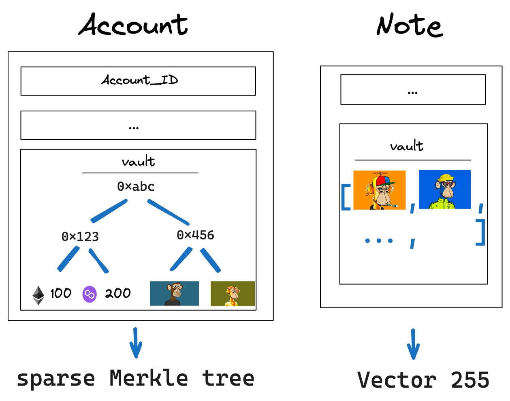

In Miden, users can create and trade arbitrary fungible and non-fungible assets.

We differentiate between native and non-native assets in Miden. Native assets follow the Miden asset model. Non-native assets are all other data structures of value that can be exchanged.

Native assets in Polygon Miden have four goals:

* Asset exchange should be parallelizable.
* Asset ownership should be self-sovereign.
* Asset usage should be censorship resistant.
* Fees can be paid using any asset.

All native assets in Miden are stored directly in accounts, like Ether in Ethereum. Miden does not track asset ownership using global hashmaps, e.g., ERC20 contracts. Local asset storage in accounts provides privacy and the ability for client-side proofs. That is because ownership changes are reflected only on an account and not in an ERC20 account (global hashmap). Thus, these changes can happen in parallel. Additionally, asset exchange is censorship resistant at this level because there is no global contract the transfer must pass through. Finally, users can pay fees in any asset.

## Native assets

Native assets are data structures that follow the Miden asset model (encoding, issuance, storing). All native assets are encoded using a single `word` (4 field elements). The asset encodes both the ID of the issuing account and the asset details. 

Having the issuer's ID encoded in the asset makes determining the type of an asset, inside and outside Miden VM, cost-efficient. And, representing the asset in a `word` means the representation is a commitment to the asset data itself. That is particularly interesting for non-fungible assets.

### Issuance

Only specialized accounts called faucets can issue assets. As with regular accounts, anyone can create a faucet account. Faucets can issue either fungible or non-fungible assets - but not both. 

The `faucet_id` identifies the faucet and starts with a different sequence depending on the asset type, see the [account id discussion](accounts.md#account-id). The faucet's code defines rules for how assets can be minted, who can mint them etc. Conceptually, faucet accounts on Miden are similar to ERC20 contracts on Ethereum. However, there is no ownership tracking in Miden faucets.

Faucets can create assets and immediately distribute them by producing notes. However, assets can also stay in the faucet after creation to be sent later, e.g., in a bundle. That way, one can mint a million NFTs locally in a single transaction and then send them out as needed in separate transactions in the future.

### Fungible assets

A fungible asset is encoded using the amount and the `faucet_id` of the faucet which issued the asset. The amount is guaranteed to be  `$2^{63} - 1$` or smaller, the maximum supply for any fungible asset. Examples of fungible assets are ETH and stablecoins, e.g., DAI, USDT, and USDC.

If the `faucet_id` of MATIC is `2`, 100 MATIC are encoded as `[100, 0, 0, 2]`; the `0`s in the middle distinguish between fungible and non-fungible assets.

### Non-fungible assets

A non-fungible asset is encoded by hashing the asset data into a `word` and then replacing the second element with the `faucet_id` of the issuing account: For example `[e0, faucet_id, e2, e3]`. Note that the second element is guaranteed to be non-zero. Together with the fungible asset encoding, this makes it easy to differentiate between both asset types by inspecting the second element.

Examples of non-fungible assets are all NFTs, e.g., a DevCon ticket. The ticket's data might be represented in a JSON string representing which DevCon, the date, the initial price, etc. Now, users can create a faucet for non-fungible DevCon tickets. This DevCon faucet would hash the JSON string into a `word` to transform the ticket into an asset.

### Storage

[Accounts](accounts.md) and [notes](notes.md) contain asset vaults that are used to store assets. Accounts can keep unlimited assets in a sparse Merkle tree called `account vault`. Notes can store up to `255` distinct assets.

The information on which and how many assets are owned can be private depending on the account's or note's storage mode. This is true for any native asset in Miden.

## Non-native assets

Miden is flexible enough to create other types of assets as well.

For example, developers can replicate the Ethereum ERC20 model, where ownership of fungible assets is recorded in a single account. To transact, users must send a note to that account to change the global hashmap.

Furthermore, a complete account can be treated as a programmable asset because ownership of accounts is transferrable. An account could be a "crypto kitty" with specific attributes and rules, and people can trade these "crypto kitties" by transferring accounts between each other.

We can also think of an account representing a car. The owner of the car can change so the car account - granting access to the physical car - can be treated as an asset. In this car account, there could be rules defining who is allowed to drive the car and when.