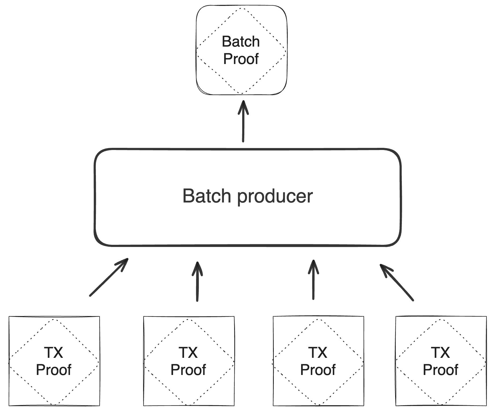

# Blockchain

The Miden blockchain protocol describes the process of how [state](state.md) progresses. `Block`s in Miden are containers that aggregate account state changes and their proofs, together with created and consumed notes. For every `Block`, there is a `Block` proof that attests to the correctness of all state transitions it contains.

`Block`s represent the delta of the global [state](state.md) between two time periods. One can derive the current global state, by applying all the blocks to the genesis state.

Miden's blockchain protocol aims for the following:

- **Proven transactions**: All included transactions have already been proven and verified when they reach the block.
- **Fast genesis syncing**: New nodes efficiently sync to the network through a multi-step process:

1. Download historical `Block`s from genesis to present
2. Verify zero-knowledge proofs for all `Block`s
3. Retrieve current state data (accounts, notes, and nullifiers)
4. Validate that the downloaded state matches the latest `Block`'s state commitment

This approach enables near-instant blockchain syncing by verifying `Block` proofs rather than re-executing individual transactions, resulting in exponentially faster performance. Hence state sync is dominated by the time needed to download the data.

    

## Batching

To reduce the load on the blockchain, transaction proofs are aggregated into batches by batch producers first, not directly into `Block`s. Batch production is highly parallelizable and there will be multiple batch producers running at the same time.

The purpose of this scheme is to produce a single proof attesting to the validity of some number of transactions which is done by recursively verifying each transaction proof in the Miden VM.

    

The batch producer processes each transaction proof sequentially and verifies each proof against the initial and final state commitment of the affected account. There are some rules that the batch producer needs to follow to ensure the correctness of the overall protocol.

First, if several transactions in the same batch affect one single account, the correct ordering must be enforced. That means if `Tx1` and `Tx2` both describe state changes of account `A`, then the batch kernel must verify in the correct order `A -> Tx1 -> A' -> Tx2 -> A''`.

Second, to prevent double spending. The batch producer needs to check the uniqueness of all notes across all transactions in the batch for the transactions to be valid.

Third, it is possible to set an expiration window for transactions which result in the batch having an expiration window, too. If transaction `A` specifies it expires at block `8`, and transaction `B` specifies it expires at block `5`, and both end up in the same batch, the batch expiration will be set to the minimum of all transaction expirations, which is `5`.

Forth, the set of notes resulting from all transactions in a batch must be free of duplicates. For example, consider two valid transactions creating exactly the same note. Both notes have the same nullifier but only one note could later be consumed because the nullifier would be marked as spent after the first one is consumed.

## Block production

To create a `Block` multiple batches and their respective proofs are aggregated into a `Block`.

`Block` production cannot happen in parallel and must be done by the Miden operator. In the future there will be several Miden operators competing for `Block` production. The schema used for `Block` production is similar to the one used in batch production - recursive verification. Multiple batch proofs are aggregated into a single `Block` proof. However, the `Block` also contains the commitments to the current global [state](state.md), the newly created nullifiers, the new state commitments for affected private accounts and the full states for all affected public accounts and newly created notes. The `Block` proof attests to the correct state transition from the previous `Block` commitment to the next and therefore to the change of the global state of Miden.

    

> **Tip: Block contents**
> - **State updates** only contain the hashes of updated elements. For example, for each updated account, we record a tuple `([account id], [new account hash])`.
> - **ZK Proof** attests that, given a state commitment from the previous `Block`, there was a set of valid batches executed that resulted in the new state commitment.
> - The `Block` also contains full account and note data for public accounts and notes. For example, if account `123` is an updated public account which, in the **state updates** section we'd see a record for it as `(123, 0x456..)`. The full new state of this account (which should hash to `0x456..`) would be included in a separate section.

## Verifying blocks

To verify that a `Block` corresponds to a valid (global) state transition, the following must be done:

1. Compute hashes of public accounts and notes states.
2. Ensure that these hashes match records in the **state updates** section (see picture).
3. Verify the included `Block` proof against the following public inputs and output:
   - Input: Previous `Block` commitment.
   - Input: Set of batches commitment.
   - Output: Current `Block` commitment.

The above can be performed by an arbitrary verifier (e.g., contract on Ethereum, Polygon AggLayer, decentralized network of Miden nodes).
