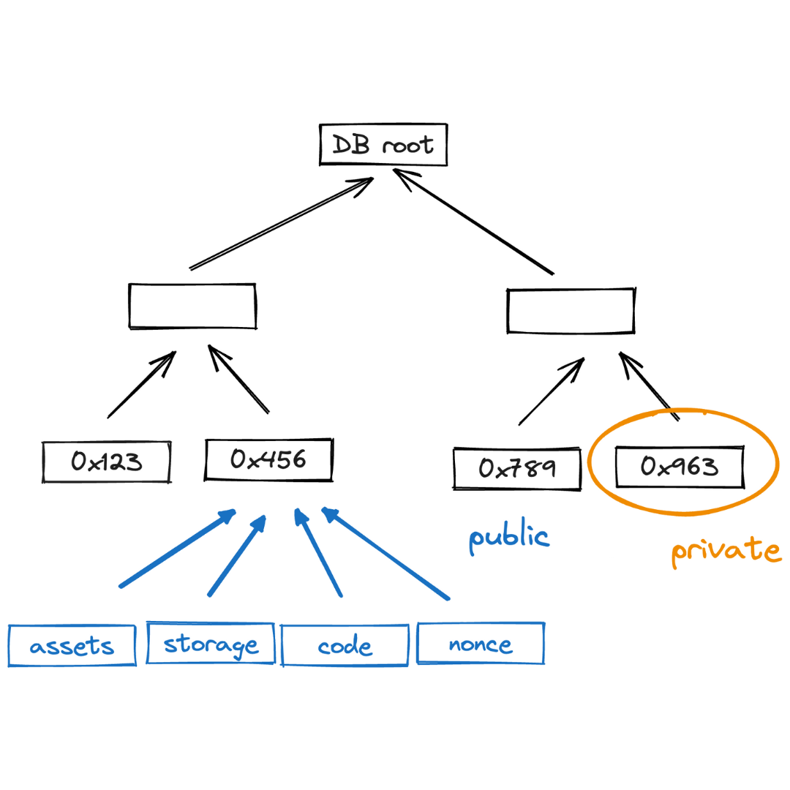

Miden rollup state describes the current condition of all accounts and notes; i.e. what is currently the case.

As the state model uses concurrent off-chain state, Polygon Miden aims for private, and parallel transaction execution and state bloat minimization.

Miden's goals include:

* Notes and nullifiers to ensure privacy of note consumption.
* Flexible data storage for users who can store their data off-chain or with the network.
* Parallel transactions executed concurrently by distinct actors.
* Concurrent state model that allows block production without knowing the full state.

Privacy is enforced by a UTXO-like state model consisting of notes and nullifiers combined with off-chain execution using zero-knowledge proofs.

State bloat describes the ever growing state stored in blockchain nodes. Polygon Miden addresses this challenge via its state model that enables concurrent off-chain execution and off-chain storage. Simply put, users can store their own data locally which reduces the burden on the network while integrity is ensured using zero-knowledge.

## State components

Miden nodes maintain three databases to describe state:

1. A database of accounts.
2. A database of notes.
3. A database of nullifiers for already consumed notes.

These databases are represented by authenticated data structures that enable easy proof of items added to or removed from a database. This ensures that the commitment to the database remains very small.

Polygon Miden has two databases to capture the note states. The note database is append-only and stores all notes permanently. The nullifier database stores nullifiers that indicate that a note has been previously consumed. Separating note storage into these two databases gives Polygon Miden client-side proving and advanced privacy.

### Account database

The latest account states - and data for on-chain accounts - are recorded in a sparse Merkle tree which maps account IDs to account hashes, and account data if needed.

As described in the [accounts section](accounts.md), there are two types of accounts:

* Public accounts where all account data is stored on-chain.
* Private accounts where only the hashes of accounts are stored on-chain.

Private accounts significantly reduce the storage overhead for nodes. A private account contributes only $40$ bytes to the global state ($8$ bytes account ID + $32$ bytes account hash). Or, said another way, 1 billion private accounts takes up only $40$ GB of state.

> **Warning**
>  Losing the state of a private account means loss of funds in a similar manner as a loss of a private key - as the user won't be able to execute transactions. This problem can be mitigated by storing encrypted account state in the cloud or backing it up somewhere else. Unlike storing private keys in the cloud, this does not compromise privacy or account security.
>
>  In the future we hope to enable encrypted accounts where the account data is stored on-chain but in an encrypted format. This is especially interesting for shared accounts like advanced multi-sig wallets.

### Note database

Notes are recorded in an append-only accumulator, a [Merkle Mountain Range](https://github.com/opentimestamps/opentimestamps-server/blob/master/doc/merkle-mountain-range.md). Each leaf is a block header which contains the commitment to all notes created in that block. The commitment is a Sparse Merkle Tree of all the notes in a block. The size of the Merkle Mountain Range grows logarithmically with the number of items in it.

As described in [the notes section](notes.md), there are two types of notes:

* Public notes where the entire note content is recorded in the state.
* Private notes where only a note's hash is recorded in the state.

As with accounts, there is a strong incentive to use private notes as they result in lower fees. This is also beneficial to the network as a private note adds only $64$ bytes to the state ($32$ bytes when it is produced, and $32$ bytes when it is consumed).

Using a Merkle Mountain Range (append-only accumulator) is important for two reasons:

1. Membership witnesses (that a note exists in the database) against such an accumulator needs to be updated very infrequently.
2. Old membership witnesses can be extended to a new accumulator value, but this extension does not need to be done by the original witness holder.

Both of these properties are needed for supporting local transactions using client-side proofs and privacy. In an append-only data structure, witness data does not become stale when the data structure is updated. That means users can generate valid proofs even if they don’t have the latest state of this database; so there is no need to query the operator on a constantly changing state.

However, the size of the note database does not grow indefinitely. Theoretically, at high tps, it grows very quickly: at $1$K TPS there are about $1$TB/year added to the database. But, only the unconsumed public notes, and enough info to construct membership proofs against them, need to be stored explicitly. Private notes, as well as public notes which have already been consumed, can be safely discarded. Such notes would still remain in the accumulator, but there is no need to store them explicitly as the append-only accumulator can be updated without knowing about all the items stored in it. This reduces actual storage requirements to a fraction of the database's nominal size.

### Nullifier database

Nullifiers are stored in a sparse Merkle tree, which maps [note nullifiers](notes.md#note-nullifier-to-ensure-private-consumption) to block numbers at which the nullifiers are inserted into the chain (or to `0` for nullifiers which haven't been recorded yet). Nullifiers provide information on whether a specific note has been consumed. The database allows proving that a given nullifier is not in the database.

To prove that a note has not been consumed previously, the operator needs to provide a Merkle path to its node, and then show that the value in that node is `0`. In our case nullifiers are $32$ bytes each, and thus, the height of the Sparse Merkle Tree needs to be $256$.

To add new nullifiers to the database, operators need to maintain the entire nullifier set. Otherwise, they would not be able to compute the new root of the tree.

> **Note**
> Nullifiers as constructed in Miden break linkability of privately stored notes and the information about the note's consumption. To know the [note's nullifier](notes.md#note-nullifier-to-ensure-private-consumption) one must know the note's data.

In the future, when the network experiences a large number of transactions per second (TPS), there will be one tree per epoch (~3 months), and Miden nodes always store trees for at least two epochs. However, the roots of the old trees are still stored. If a user wants to consume a note that is more than $6$ months old, there must be a merkle path provided to the Miden Node for verification.

## State bloat minimization

Operators don’t need to know the entire state to verify or produce a new block. No operator is required to store the entire state.

At its core, the idea is simple: Instead of storing the full state data with the operators, the users store their data, and the rollup only keeps track of commitments to the data. At least for private accounts, some smart contracts need to be publicly visible. This minimizes state bloat—as the operator doesn’t need to store an ever-growing database, and provides privacy because all other users and the operator only see a hash of other users’ data.

That way the account and note databases remain manageable, even at high usage for extended periods of time.
