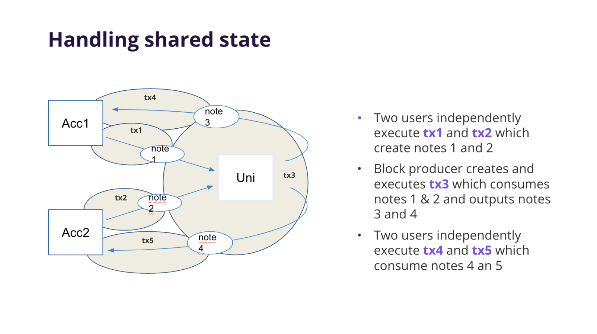

# State

## What is the purpose of state?

Miden enables secure, private, and scalable transaction execution. By employing a concurrent state model with local execution and proving, Miden achieves three primary objectives: preserving privacy, supporting parallel transactions, and minimizing on-chain data storage (state bloat).

Miden’s state model focuses on:

- **Privacy:**  
  By using notes and nullifiers, Miden ensures that value transfers remain confidential. Zero-knowledge proofs allow users to prove correctness without revealing sensitive information.

- **Flexible data storage:**  
  Users can store data privately on their own devices or within the network. This approach reduces reliance on the network for data availability, helps maintain user sovereignty, and minimizes unnecessary on-chain storage.

- **Parallelizable Execution:**  
  Multiple transactions can be processed concurrently by distinct actors which improves throughput and efficiency.

Miden’s state model supports a private, secure, and high-throughput environment while also addressing the challenges of state bloat commonly associated with continuously growing blockchain states.

## What is state?

The state of the Miden rollup describes the current condition of all accounts and notes in the protocol; i.e., the current reality.

## State model components

The Miden node maintains three databases to describe state:

1. Accounts
2. Notes
3. Nullifiers

### Accounts database

The accounts database stores the latest account states for public accounts or state commitments for private accounts.

As described in the [accounts section](accounts.md), there are two types of accounts:

- **Public accounts:** where all account data is stored on-chain.
- **Private accounts:** where only the hash of the account is stored on-chain.

Private accounts significantly reduce storage overhead. A private account contributes only $40$ bytes to the global state ($8$ bytes for the account ID + $32$ bytes for the account hash). For example, 1 billion private accounts take up only $40$ GB of state.

The storage contribution of a public account depends on the amount of data it stores.

> **Warning**
> - In Miden, when the user is the custodian of their account state (in the case of a private account), losing this state amounts to losing their funds, similar to losing a private key.

### Notes database

As described in the [notes section](notes.md), there are two types of notes:

- **Public notes:** where the entire note content is stored on-chain.
- **Private notes:** where only the note’s hash is stored on-chain.

Private notes greatly reduce storage requirements and thus result in lower fees. They add only $64$ bytes to the state ($32$ bytes when produced and $32$ bytes when consumed).

At high throughput (e.g., 1K TPS), the note database could grow by about 1TB/year. However, only unconsumed public notes and enough information to construct membership proofs must be stored explicitly. Private notes, as well as consumed public notes, can be discarded. This solves the issue of infinitely growing note databases.

### Nullifiers database

Nullifiers map one-to-one to existing notes, tracking whether a note has been consumed.

To prove that a note has not been consumed, the operator must provide a Merkle path to the corresponding node and show that the node’s value is `0`. Since nullifiers are $32$ bytes each, the Sparse Merkle Tree height must be sufficient to represent all possible nullifiers. Operators must maintain the entire nullifier set to compute the new tree root after inserting new nullifiers.

> **Note**
> - Nullifiers in Miden break linkability between privately stored notes and their consumption details. To know the [note’s nullifier](notes.md#note-nullifier-ensuring-private-consumption), one must know the note’s data.

## Additional information

### Public shared state

To handle public shared state in Miden (e.g., AAVE, Uniswap), users and developers can replicate the following model:

In this diagram, multiple participants interact with a common, publicly accessible state. The figure illustrates how notes are created and consumed:

1. **Independent Transactions Creating Notes (tx1 & tx2):**  
   Two separate users (Acc1 and Acc2) execute transactions independently:
   - `tx1` produces **note 1**
   - `tx2` produces **note 2**

   These transactions occur in parallel and do not rely on each other, allowing concurrent processing without contention.

2. **Sequencing and Consuming Notes (tx3):**  
   A Miden node executes `tx3` against the shared account, consuming **notes 1 & 2** and producing **notes 3 & 4**. This merges independent contributions into a unified state update.

3. **Further Independent Transactions (tx4 & tx5):**  
   After the shared state is updated:
   - `tx4` consumes **note 4**
   - `tx5` consumes **note 5**
   
   Both users can now interact with notes generated by the public account, continuing the cycle of state evolution.

### State bloat minimization

Operators do not need to know the entire state to verify or produce new blocks. Rather than storing the full state data with operators, users keep their data locally, and the rollup stores only commitments to that data. While some contracts must remain publicly visible, this approach minimizes state bloat and preserves privacy, since operators and other users only see hashes of user data.

This ensures that the account and note databases remain manageable, even under sustained high usage.

## Conclusion

Miden’s state model lays the foundation for a scalable, privacy-preserving, and user-centric environment. By combining parallelizable execution, flexible data storage, and Zero-knowledge proofs that ensure integrity and confidentiality, Miden addresses many of the challenges of traditional blockchains. As a result, the network can handle high throughput, maintain manageable state sizes, and support a wide range of applications.
