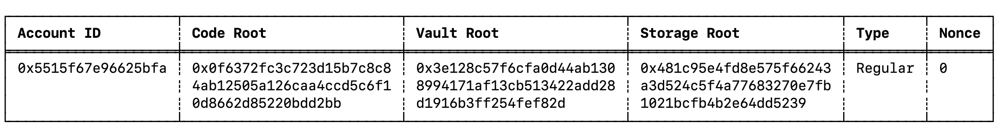
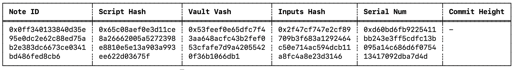
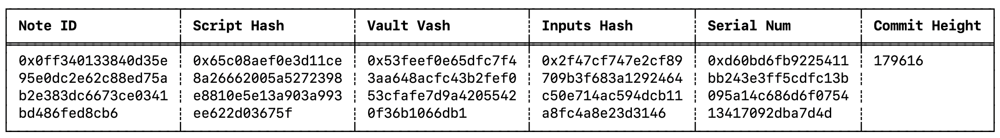
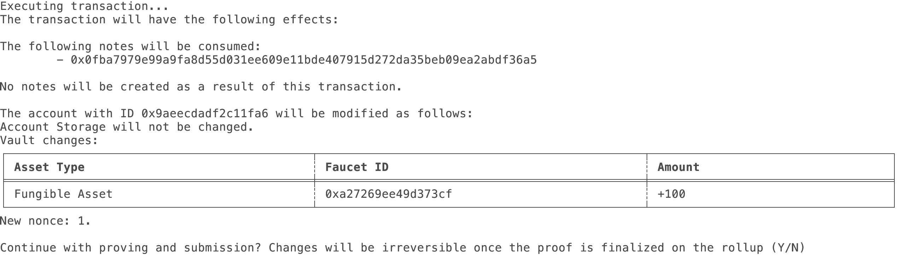
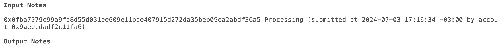
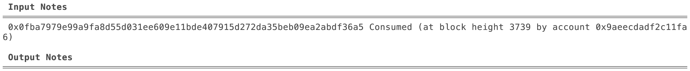
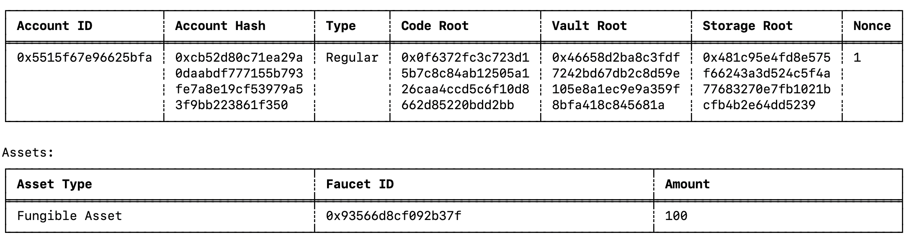

In this section, we show you how to create a new local Miden account and how to receive funds from the public Miden faucet website.

## Configure the Miden client

The Miden client facilitates interaction with the Miden rollup and provides a way to execute and prove transactions.

!!! tip
      Check the [Miden client documentation](https://docs.polygon.technology/miden/miden-client/cli-reference/) for more information.

1. If you haven't already done so as part of another tutorial, open your terminal and create a new directory to store the Miden client.

    ```sh
    mkdir miden-client
    cd miden-client
    ```

2. Install the Miden client.

      ```shell
      cargo install miden-cli --features testing,concurrent
      ```
      You can now use the `miden --version` command, and you should see `Miden 0.6.0`.

3. Initialize the client. This creates the `miden-client.toml` file.

```shell
miden init --rpc 18.203.155.106
```
For the --rpc flag, enter the IP that the Miden team supplied.

## Create a new Miden account

1. Create a new account of type `mutable` using the following command:

      ```shell
      miden new-wallet --mutable
      ```

2. List all created accounts by running the following command:

      ```shell
      miden account -l
      ```
      You should see something like this:

      

Save the account ID for a future step.

## Request tokens from the public faucet

1. To request funds from the faucet navigate to the following website: [Miden faucet website](https://testnet.miden.io/).

2. Copy the **Account ID** printed by the `miden account -l` command in the previous step. Feel free to change the amount of tokens to issue.

3. Paste this ID into the **Request test tokens** input field on the faucet website and click **Send Private Note**.

!!! tip
      You can also click **Send Public Note**. If you do this, the note's details will be public and you will not need to download and import it, so you can skip to [Sync the client](#sync-the-client).  

4. After a few seconds your browser should download - or prompt you to download - a file called `note.mno` (mno = Miden note). It contains the funds the faucet sent to your address.

5. Save this file on your computer, you will need it for the next step. 

## Import the note into the Miden client

1. Import the private note that you have received using the following commands: 

      ```shell
      miden import <path-to-note>/note.mno
      ```

2. You should see something like this:

      ```sh
      Successfully imported note 0x0ff340133840d35e95e0dc2e62c88ed75ab2e383dc6673ce0341bd486fed8cb6
      ```

3. Now that the note has been successfully imported, you can view the note's information using the following command: 

      ```shell
      miden notes
      ```

4. You should see something like this:

      

!!! tip "The importance of syncing"
      - As you can see, the note is listed as `Expected`.
      - This is because you have received a private note but have not yet synced your view of the rollup to check that the note is the result of a valid transaction.
      - Hence, before consuming the note we will need to update our view of the rollup by syncing.
      - Many users could have received the same private note, but only one user can consume the note in a transaction that gets verified by the Miden operator.

### Sync the client

Do this periodically to keep informed about any updates on the node by running the `sync` command:

```shell
miden sync
```

You will see something like this as output:

```sh
State synced to block 179672
New public notes: 0
Tracked notes updated: 1
Tracked notes consumed: 0
Tracked accounts updated: 0
Commited transactions: 0
```

## Consume the note & receive the funds

1. Now that we have synced the client, the input-note imported from the faucet should have a `Committed` status, confirming it exists at the rollup level:

      ```shell
      miden notes
      ```

2. You should see something like this:

      

3. Find your account and note id by listing both `accounts` and `notes`:

      ```shell
      miden account
      miden notes
      ```

4. Consume the note and add the funds from its vault to our account using the following command: 

      ```shell
      miden consume-notes --account <Account-Id> <Note-Id>
      ```

5. You should see a confirmation message like this:

      

6. After confirming you can view the new note status by running the following command:

      ```shell
      miden notes
      ```

7. You should see something like this:

      

8. The note is `Processing`. This means that the proof of the transaction was sent, but there is no network confirmation yet. You can update your view of the rollup by syncing again:

      ```shell
      miden sync
      ```

9. After syncing, you should have received confirmation of the consumed note. You should see the note as `Consumed` after listing the notes:

      ```shell
      miden notes
      ```

      


  Amazing! You just have created a client-side zero-knowledge proof locally on your machine and submitted it to the Miden rollup.

!!! tip
      You only need to copy the top line of characters of the Note ID.

## View confirmations

5. View your updated account's vault containing the tokens sent by the faucet by running the following command: 

      ```shell
      miden account --show <Account-Id>
      ```

6. You should now see your accounts vault containing the funds sent by the faucet. 

      

## Congratulations!

You have successfully configured and used the Miden client to interact with a Miden rollup and faucet.

You have performed basic Miden rollup operations like submitting proofs of transactions, generating and consuming notes.

For more information on the Miden client, refer to the [Miden client documentation](https://docs.polygon.technology/miden/miden-client/).

## Debugging tips (clear state and folder)

- Need a fresh start? All state is maintained in `store.sqlite3`, located in the directory defined in the `miden-client.toml` file. If you want to clear all state, delete this file. It recreates on any command execution.

- Getting an error? Only execute the `miden-client` command in the folder where your `miden-client.toml` is located.
