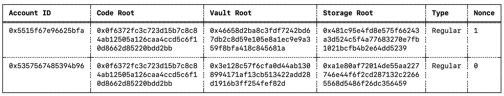
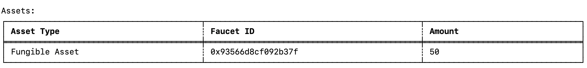
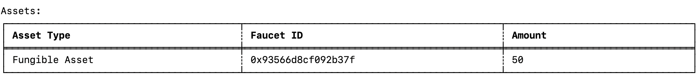

In this section, we show you how to make private transactions and send funds to another account using the Miden client. 

!!! important "Prerequisite steps"
    - You should have already followed the [prerequisite steps](prerequisites.md) and [get started](create-account-use-faucet.md) documents.
    - You should *not* have reset the state of your local client. 

## Create a second account

!!! tip
      Remember to use the [Miden client documentation](https://docs.polygon.technology/miden/miden-client/cli-reference/) for clarifications.

1. Create a second account to send funds with. Previously, we created a type `mutable` account (account A). Now, create another `mutable` (account B) using the following command:

      ```shell
      miden new-wallet --mutable
      ```

2. List and view the newly created accounts with the following command:

      ```shell
      miden account -l
      ```

3. You should see two accounts:

      

## Transfer assets between accounts

1. Now we can transfer some of the tokens we received from the faucet to our second account B. 

    To do this, run:

    ```shell
    miden send --sender <regular-account-id-A> --target <regular-account-id-B> --asset 50::<faucet-account-id> --note-type private
    ```

    !!! note
        The faucet account id can be found on the [Miden faucet website](https://testnet.miden.io/) under the title **Miden faucet**.

    This generates a private Pay-to-ID (`P2ID`) note containing `50` assets, transferred from one account to the other. 

2. First, sync the accounts.

    ```shell
    miden sync
    ```

3. Get the second note id.

    ```sh
    miden notes
    ```

4. Have the second account consume the note.

    ```sh
    miden consume-notes --account <regular-account-ID-B> <input-note-id>
    ```

    !!! tip
        It's possible to use a short version of the note id: 7 characters after the `0x` is sufficient, e.g. `0x6ae613a`.

    You should now see both accounts containing faucet assets with amounts transferred from `Account A` to `Account B`.

5. Check the second account:

    ```shell
    miden account --show <regular-account-ID-B>
    ```

    

6. Check the original account:

    ```sh
    miden account --show <regular-account-ID-A>
    ```

    

Wanna do more? [Sending public notes](p2p-public.md)

## Congratulations!

You have successfully configured and used the Miden client to interact with a Miden rollup and faucet. 

You have performed basic Miden rollup operations like submitting proofs of transactions, generating and consuming notes.

For more information on the Miden client, refer to the [Miden client documentation](https://docs.polygon.technology/miden/miden-client/).

## Clear data

All state is maintained in `store.sqlite3`, located in the directory defined in the `miden-client.toml` file. 

To clear all state, delete this file. It recreates on any command execution.

</br>
