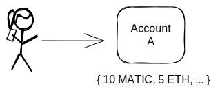
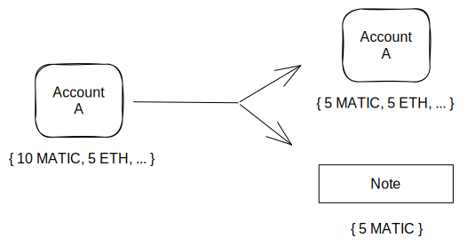
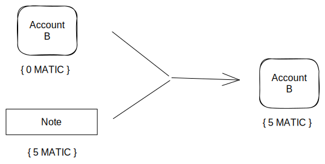
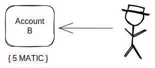

# Architecture
The Polygon Miden Architecture decribes the concepts of how the participants of the network can interact with each other. The architecture reflects the design goal: We aim to build an Ethereum scaling solution that extends its feature set. We want to enable developers to build faster, safer and more private dApps. Rollups allow the creation of new design spaces while retaining the collateral security of Ethereum. This is where to innovate, whereas the base layer should provide stability and evolve slowly.

We believe that to attract billions of users to Ethereum, we need to extend it on three dimensions: scalability, safety, and privacy. 

The actor model is our inspiration for achieving concurrent, local state changes on a distributed system like a blockchain. In the actor model, actors play the role of little state machines, meaning each actor is responsible for their own state. Actors have inboxes to send and receive messages to communicate with other actors. Messages can be read asynchronously.

## Concepts in Miden
Users can interact on the network executing transactions. Sucessfull transactions trigger a state change. Transactions are always executed against single accounts and produce or consume at least one note. This is similar to the [Actor Model](https://en.wikipedia.org/wiki/Actor_model). The state of all accounts and notes is committed to via the L2 state root which is being published and accompanied by a ZK proof and additional data to Ethereum. This is similar to any other zkRollup. 

The concepts which constitutes the Miden Architecture are 

* Accounts and Notes and the Transaction Model
* State and Execution Model

## Transaction life cycle 
To illustrate the core protocol, let's look at how Alice can send Bob 5 MATIC in Polygon Miden. The basic building blocks of Polygon Miden are Accounts, Notes and Transactions. 

_Note: Because of the asynchronous execution model two transactions are needed to transfer the assets._

    

Alice owns an account that holds her assets.

    

Alice can execute a transaction that creates a note carrying 5 MATIC and changing her account to own 5 MATIC less.

    

Now in Miden there would be Alice's account, the note, and Bob's account. Because Bob hasn't consumed the note yet.

    

For Bob to finally receive the 5 MATIC, he needs to consume the note that Alice created in her transaction. To do so, Bob needs to execute a second transaction.

    

Now, Bob got 5 MATIC in his account. 

## State and Execution Model
The State Model defines how the current state of all accounts and notes at a certain point in time can be thought of. And the Execution Model defines the rules about how this state progresses from `t` to `t+1`.
