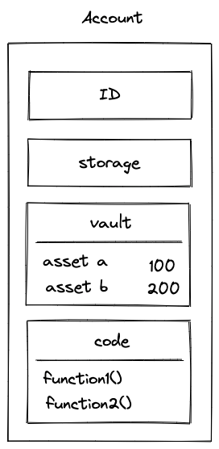
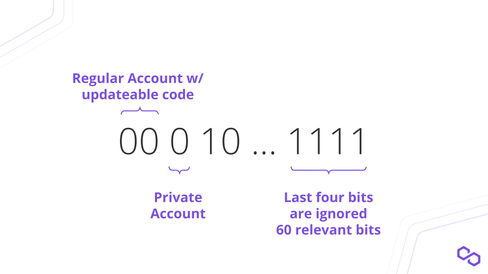

# Accounts
Accounts are entities that hold assets and determine the rules for transferring those assets. The figure below depicts the fundamental components of an account. **Every account in Miden is inherently a smart contract**.

    

In the above picture, you can see:

* **Account ID &rarr;** a unique identifier of an account which does not change throughout its lifetime
* **Storage &rarr;** a user-defined data which can be stored in an account
* **Nonce &rarr;** a counter which must be incremented whenever account state changes
* **Vault &rarr;** a collection of assets stored in an account
* **Code &rarr;** a collection of functions which define an external interface for an account

## Account ID

The account identifier is **8 bytes (64 bits)** long. Its type and storage mode are specified by the first three significant bits. Miden has four different types of accounts that can be saved in two different ways. Below diagram depicts an example Account ID.

    

### Account Types

1. Regular account with updatable code
    This account type will be used by most users. They can specify and change their code and use this account for connecting with a wallet. The Account ID will always start with `00`.

2. Regular account with immutable code
    This account type will be used by most smart contracts. The code should not change after it is deployed, and no one should be able to update it. The Account ID will begin with the letter '01'.

3. Fungible asset faucet with immutable code
    Assets need to be created by accounts in Miden. The Account ID will start with `10`. 

4. Non-fungible asset faucet with immutable code
    Assets need to be created by accounts in Miden. The Account ID will start with `11`.

### Account Storage Modes
Account data which is stored in a Miden Node can be either `public` or `private`. The third most significant bit ([MSb](https://en.wikipedia.org/wiki/Bit_numbering)) of the Account ID specifies whether the account data is public (`0`) or private (`1`).

0. Accounts with **public state** store their actual state on chain, similar to how accounts work in public blockchains like Ethereum.
1. Accounts with **private state** store only the hash of their account on chain. The hash is defined as: \
`hash([account ID, 0, 0, nonce], [vault root], [storage root], [code root])`

## Storage
Storage refers to `AccountStorage`, the user-defined data that can be stored in an account. Account storage is made up of two components. The first component is an index addressable basic Sparse Merkle Tree of depth 8. This gives the user 256-word slots.

Users that require additional storage can use the second component which is a `MerkleStore`. This will allow the user to store any Merkle structures they need. This is achieved by storing the Merkle structure's root as a leaf in the simple Sparse Merkle Tree. When `AccountStorage` is serialized, it will examine the leaves of the simple Sparse Merkle Tree to see whether any of them are Merkle roots of other Merkle structures. If any Merkle roots are found, the Merkle structures will be saved in the `AccountStorage` `MerkleStore`.

- TODO ADD STORAGE DIAGRAM

## Nonce
It is basically a counter which must be incremented whenever the account state changes. Nonce values must be **strictly monotonically increasing** and can be incremented by any value smaller than 232 for every account update.

## Vault
Vault is the asset container of an account. It can contain an unlimited number of assets. The assets are stored in a Sparse
Merkle tree as follows:

* For fungible assets, the index of a node is defined by the issuing faucet ID, and the value
  of the node is the asset itself. Thus, for any fungible asset there will be only one node
  in the tree.
* For non-fungible assets, the index is defined by the asset itself, and the asset is also
  the value of the node.

An account vault can be reduced to a single hash which is the root of the Sparse Merkle tree.

## Code
Every account in Miden is a smart contract with an interface that exposes functions that note scripts can call.  The interface for accounts is referred to as Code.

The account's exposed functions have the following properties:

* Functions are actually roots of [Miden program MASTs](https://wiki.polygon.technology/docs/miden/user_docs/assembly/main) (i.e., 32-byte hash). Thus, function identifier is a commitment to the code which is executed when a function is invoked.
* Only account functions have mutable access to an account's storage and vault. Therefore, the only way to modify an account's internal state is through one of account's functions.
* Account functions can take parameters and can create new notes.

## Account creation
For an account to exist it must be present in the [Account DB](https://0xpolygonmiden.github.io/miden-base/architecture/state.html#account-database) kept by the Miden Node(s). However, new accounts can be created locally by users through a wallet.

The process is as follows:

* Alice grinds a new Account ID (according to the account types) using a wallet
* Alice's Miden Client requests the Miden Node to check if new Account ID already exists
* Alice shares the new Account ID to Bob (eg. when Alice wants to receive funds)
* Bob executes a transaction and creates a note that contains an asset for Alice
* Alice consumes Bob's note to receive the asset in a transaction
* Depending on the account storage mode (`private` or `public`) and transaction type (local or network), the Operator receives new Account ID eventually and adds the ID to the Account DB if transaction is correct.
