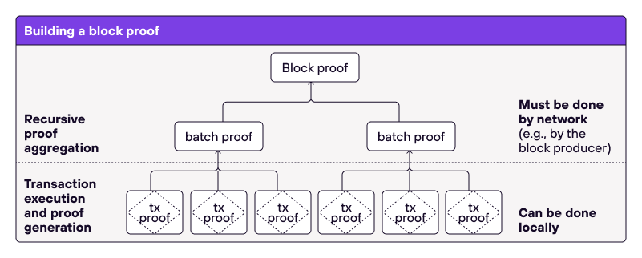
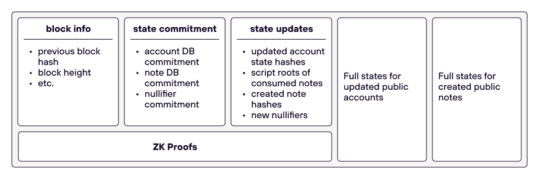

# Execution Model

The Execution Model describes how the state progresses - on an individual level via transactions and at the global level expressed as aggregated state updates in blocks. 

Polygon Miden is a Rollup. It batches transactions - or more precisely, proofs thereof - that happen together in the same time period into a block. 

  

## Transaction Execution

Every transaction will result in a ZK proof that attests to its correctness.

As mentioned in [transactions](https://0xpolygonmiden.github.io/miden-base/architecture/transactions.html#local-vs-network-transactions), there are two types of transactions: local transactions and network transactions. For every transaction there is a proof - either created by the user in the Miden Client or by the operator using the Miden Node. 

## Transaction Batching
To reduce the required space on the Ethereum blockchain, transaction proofs are being aggregated into batches. This can happen in parallel by different machines that need to verify several proofs using the Miden VM and thus creating a proof thereof. Verifying a STARK proof within the VM is relatively efficient - but it is still a pretty costly operation (we aim for 2^16 cycles).

## Block Production
Several batch proofs are being aggregated together into one block. This can not happen in parallel and must be done by the Miden Operator running the Miden Node. The idea is the same, using recursive verification.

# State progress 
At the beginning Miden will have a centralized operator running a Miden Node.

* The Miden Node collects proofs or transactions to be proven from the users.
* The Miden Node aggregates collected transaction proofs into batches using recursive verification.
* The Miden Node aggregates batch proofs into blocks.
* The blocks get submitted to Ethereum, and once a block is included in the L1 chain, the rollup chain is assumed to have moved to the next state. (not specified yet)

A block which the Miden Node produces looks like this:

  

* **state updates** contain only the hashes of changes. For example, for each account which was updated, we record a tuple `([account id], [new account hash])`.
* The included **zk proof** attests that given a state commitment from the previous block, there was a sequence of valid transactions executed that resulted in the new state commitment, and also output included state updates.
* The block also contains full account and note data for public accounts and notes. For example, if account `123` is a public account which was updated, in the *state updates* section we'd have a records for it as `(123, 0x456..)`. The full new state of this account (which should hash to `0x456..`) would be included in a separate section.

To verify that a block describes a valid transition, we do the following:
1. Compute hashes of public account and note states.
2. Make sure these hashes match records in the *state updates* section.
3. Verify the included ZKP against the following public inputs:
   - State commitment from the previous block.
   - State commitment from the current block.
   - State updates from the current block.

The above can be performed by a verifier contract on Ethereum.

This structure has another nice property: it is very easy for a new node to sync up to the current state from genesis. The new node would need to do the following:
1. Download only the first parts of the blocks (i.e., without full account/note states) starting at the genesis up until the latest block.
2. Verify all ZKPs in the downloaded blocks. This will be super quick (exponentially faster than re-executing original transactions) and can also be done in parallel.
3. Download the current states of account, note, and nullifier databases.
4. Verify that the downloaded current state matches the state commitment in the latest block.

Overall, state sync is dominated by the time needed to download the data.
