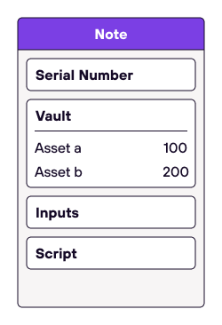

# Notes
Miden aims to achieve parallel transaction execution and privacy. The UTXO-model combined with client-side proofs provide those features. That means, in Miden exist notes as a way of transferring assets between and to interact with accounts. Notes can be consumed and produced asynchronously and privately. The concept of notes is a key difference between Ethereum’s Account-based model and Polygon Miden, which uses a hybrid UTXO- and Account-based [state-model](state.md). 

# Note design
The diagram below illustrates the contents of a note:

    

As shown in the above picture:
* **Vault &rarr;** serves as [asset](assets.md) container for a note. It can contain up to `255` assets stored in an array which can be reduced to a single hash.
* **Script &rarr;** will be executed in a [transaction](https://0xpolygonmiden.github.io/miden-base/architecture/transactions.html) aginst a single account, see next chapter.
* **Inputs &rarr;** are placed onto the stack as parameters before a note's script is executed.
* **Serial number &rarr;** a note's unique identifier to break linkability between [note hash](https://0xpolygonmiden.github.io/miden-base/architecture/notes.html#note-hash) and [nullifier](https://0xpolygonmiden.github.io/miden-base/architecture/notes.html#note-nullifier). Should be a random `Word` chosen by the user - if revealed, the nullifier might be computed easily.

# Note scripts
In Polygon Miden, accounts communicate with one another by producing and consuming notes. Notes are messages carrying assets that accounts can send to each other—a note stores assets and a script that defines how this note can be consumed. The script allows for more than just the transferring of assets. It is always executed in the context of a single account, and thus, may invoke zero or more of the [account's functions](https://0xpolygonmiden.github.io/miden-base/architecture/accounts.html#code). Note scripts can become arbirarly complex due to the underlying Turing-complete Miden VM. 

In `miden-lib` there are predefined P2ID and P2IDR note scripts that every user can simply create, see [code](https://github.com/0xPolygonMiden/miden-base/blob/fa63b26d845f910d12bd5744f34a6e55c08d5cde/miden-lib/src/notes/mod.rs#L15-L66). The script ensures that only the specified target account can consume the note and receive the asset. 

The Note scripts is also the root of a [Miden program MAST](https://0xpolygonmiden.github.io/miden-vm/user_docs/assembly/main.html) which means every function is a commitment to the underlying code. The code cannot change unnoticed to the user because its hash would change.

# Note recipient 
We define `recipient` as: `hash(hash(hash(serial_num, [0; 4]), script_hash), input_hash)` represented as `Word`. The account that executes a given note needs to provide the pre-image data to `recipient` during the transaction prologue. That means, one can create notes that can only be consumed if the `serial_num` and other data is known. This information can be passed on off-chain by the sender to the recipient. 

# Note storage modes
Similar to accounts, there are two storage modes for notes in Miden. Notes can be stored privately in the [Notes DB](https://0xpolygonmiden.github.io/miden-base/architecture/state.html#notes-database) with only the note hash. Or notes can be stored publicly with all data.

Privately stored notes can only be consumed if the note data is known to the consumer. That means, there must be some offchain communication to transmit the note's data from the sender to the receipient.

# Note metadata
For every note the Miden Operator stores metadata in the Note DB. This metadata includes:

* A **user-defined tag** as a means to quickly grab all notes for a certain application or use case.
* A **sender** to be able to provide also ERC20 contract functionality.
* The **number of assets** contained in the note. 

# Note hash
The note hash is computed as:

`hash(hash(hash(hash(serial_num, [0; 4]), script_hash), input_hash), vault_hash)`

This achieves the following properties:
- Every note can be reduced to a single unique hash.
- To compute a note's hash, we do not need to know the note's `serial_num`. Knowing the hash
    of the `serial_num` (as well as `script_hash`, `input_hash` and `note_vault`) is sufficient.
- Moreover, the note hash can be computed having the [recipient](https://0xpolygonmiden.github.io/miden-base/architecture/notes.html#note-recipient) and note vault, as `hash(recipient, vault_hash)`.
- We compute the hash of `serial_num` as `hash(serial_num, [0; 4])` to simplify processing within the VM.

# Note nullifier
The nullifier is the note's index in the [Nullifier DB](https://0xpolygonmiden.github.io/miden-base/architecture/state.html#nullifier-database). The Nullifier DB stores the information whether a note was already consumed.

The nullifier is computed as `hash(serial_num, script_hash, input_hash, vault_hash)`.

This achieves the following properties:
- Every note can be reduced to a single unique nullifier.
- We cannot derive a note's hash from its nullifier.
- To compute the nullifier, we must know all components of the note: `serial_num`, `script_hash`, `input_hash`, and `vault_hash`.

To know a note’s nullifier, one needs to know all details of the note, e.g. the note's serial number. That means if a note is private and the operator stores only the note's hash, only those with the note details know if this note has been consumed already. Zcash first introduced this approach.

    

# Note lifecycle
New notes are being produced when executing a transaction. After verifying the transaction proof the Operator adds the note to the [Notes DB](https://0xpolygonmiden.github.io/miden-base/architecture/state.html#notes-database). Notes can be produced and consumed locally by users in local transactions or by the operator in a network transaction. Note consumption requires the transacting party to know the note data to compute the nullifier. After successful verification, the Operator sets the corresponding entry in the Nullifier DB to `1`. 

    

