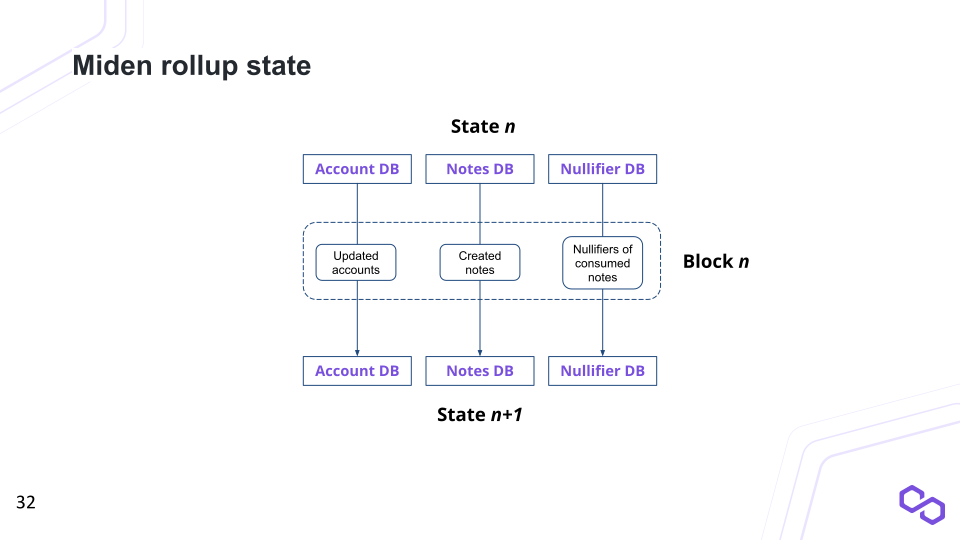
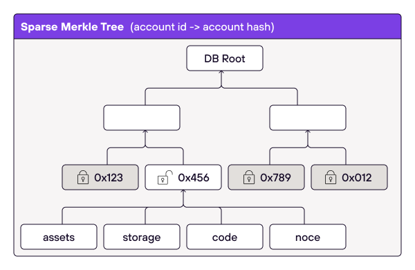
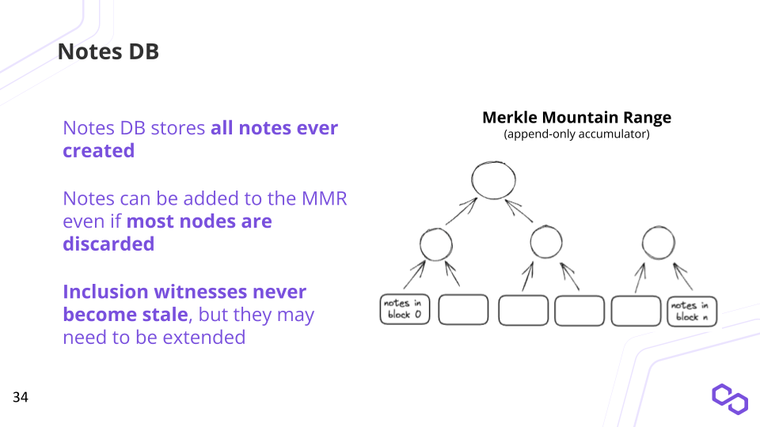
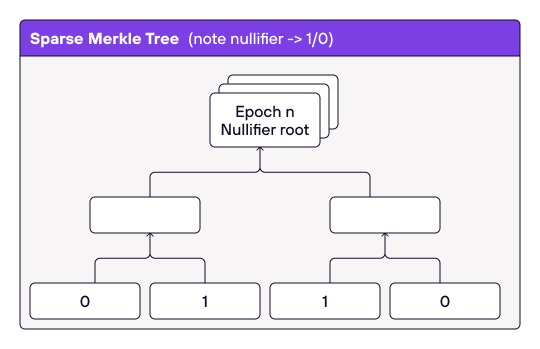

# State

the system maintains 3 databases to describe the state:
1. A database of accounts.
2. A database of notes.
3. A database of nullifiers for already consumed notes.

  

## State components

As mentioned above, the state consists of 3 components: account, note, and nullifier databases. These databases are represented by authenticated data structures (e.g., Merkle trees), such that we can easily prove that items were added to or removed from a database, and a commitment to the database would be very small.

### Account database
Account states could be recorded in a Sparse Merkle tree (or a variation thereof) which maps account IDs to account hashes, where account hash is computed as `hash([account ID], [storage root], [vault root], [code root])`.

  

There could be two types of accounts:
* **Public accounts** where all account data is stored on-chain. Transactions executed against such accounts must be *network transactions* - i.g., transactions executed by the network.
* **Private accounts** where only the hashes of accounts are stored on-chain. Transactions executed against such accounts must be *local transactions* - i.e., transactions where the user submits a ZKP to the network attesting to the correct execution of the transactions. (it is possible to relax this condition so that users could execute network transactions against private accounts, in which case, all account data would need to be included in a specific transaction - but for simplicity, I won't consider this here).

It is important to note that fees for local transactions will probably be much lower than fees for network transactions (because for a local transaction, the network just needs to verify a ZKP). Thus, users are incentivized to use private accounts, unless they indeed need the functionality offered by public accounts.

A potential concern could be that losing a state of a private account would mean loss of funds (as the user won't be able to execute transactions) in a similar manner as a loss of a private key would. But this problem can be easily mitigated by storing encrypted account state in a cloud or backing it up somewhere else. Unlike storing private keys in the cloud, this would not compromise privacy or security of an account.

Having many (or even most) of the accounts be private is very beneficial for the network as a private account contributes only 64 bytes to the global state (32 bytes account ID + 32 bytes account hash). Or, said another way, 1 billion private accounts takes up only $60$ GB of state.

The situation with public accounts is a bit more challenging - but our model has very nice properties here too.

First, observe that to verify validity of state transition we do not need to know full account states (i.e., we just need to know hashes of the state so that we can verify ZKPs). We need to know full account states only to execute public transactions agains them.

Thus, as a node, we could chose to discard full states for public accounts which haven't been used for some time. All this means is that we won't be able to execute transactions against these accounts, but if someone else execute a transaction against them, we can still verify that the state transition was valid (and we'll get the new full state of the account with the latest block).

It is important to note that the decision when to discard full account states does not need to be a part of the protocol - every node could decide for themselves. For example, there could be nodes which prune full state very aggressively, and in effect, they would only be able to include private transactions in their blocks. There could also be nodes which decide to keep full account states for years - so that they could execute transactions which few other nodes could (presumably for a higher fee).

This approach eliminates the need for complicated mechanisms such as state rent. The longer a public account remains unused, the fewer nodes would want to keep its full state. The fewer nodes keep its full, state, the higher fees can be demanded for executing transactions against this account. Thus, the nodes which chose to keep full states longer should get naturally compensated for their services.

### Note database

Notes could be recorded in an append-only accumulator similar to the one described [here](https://eprint.iacr.org/2015/718). Using such an accumulator is important for two reasons:

1. Membership witnesses against such an accumulator needs to be updated very infrequently.
2. Old membership witnesses can be extended to be used with a new accumulator value, but this extension does not need to be done by the original witness holder.

Both of these properties are needed for supporting local transactions and private accounts.

Notes database could look as shown on the diagram below. Here, the database contains $6$ notes: $1$ through $6$, and the commitment to this database are the roots of individual trees `(a, b)`. Thus, the size of the commitment grows logarithmically with the number of items in it.

  

As with accounts, there could be two types of notes:
* **Public notes** where the entire note content is recorded in the state. Such notes can be consumed either in local or in network transactions - but in either case, they don't provide any privacy guarantees (i.e., it will be trivial to figure out which account consumed such notes).
* **Private notes** where only a note's hash is recorded in the state. Such notes can be consumed only in local transactions (though it is possible to relax this condition).

As with accounts, there would be a strong incentive to use private notes as they would result in lower fees. This is also beneficial to the network as a private note adds only 64 bytes to the state (32 bytes when it is produced, and 32 bytes when it is consumed).

Using an append-only accumulator means that we can't remove individual elements from it. This would seemingly mean that the size of the note database would grow indefinitely. Moreover, at high tps, it would grow very quickly: at 1K tps we'd be adding about 1TB/year to the database.

However, we need to explicitly store only the unconsumed public notes and enough info to construct membership proofs against them. Private notes, as well as public notes which have already been consumed, can be safely discarded. Such notes would still remain in the accumulator, but there is no need to store them explicitly as the append-only accumulator can be updated without knowing all items stored in it. This would reduce actual storage requirements to a fraction of the database's nominal size.

Moreover, since notes are not meant as long-lived objects, we can impose some lifetimes restrictions on them. For example, we could say that the system will store only $2^{35}$ most recent notes (a note not consumed in this timeframe becomes un-spendable). This can be easily done by discarding old commitment roots once the number of roots exceeds 35. At 1K tps this would mean that notes would be discarded after about 1 year, but this would also mean that the size of the note database will never grow beyond about 1TB.

### Nullifier database

With nullifier database we want to achieve the following properties:
1. We need to be able to check that a given nullifier is not in the database. This is needed to ensure that notes consumed in a transaction haven't been already consumed.
2. We need to be able to prove that a given nullifier is not in the database. This is needed for state transition proofs we want to submit to L1.
3. We need to be able to add new nullifiers to the database. This would be done by an operator at the time when they create a new block.

To satisfy these properties we can use a Sparse Merkle tree which maps nullifiers to block heights at which they were created. For example, in the diagram below, the tree contains 2 nullifiers: nullifier `01` was inserted into the database at block height $4$, while nullifier `10` was inserted into the database at block height $5$.

  

To prove that nullifier `11` is not in the database we need to provide a Merkle path to its node, and then show that the value in that node is $0$. In our case nullifiers would be 32 bytes each, and thus, the height of the Sparse Merkle tree would need to be 256.

To be able to add new nullifiers to the database, operators needs to maintain the entire nullifier set - otherwise they would not be able to compute the new root of the tree. This presents a challenge similar to the one we encountered with the note database: the set of nullifiers seemingly needs to grow indefinitely. Worse, unlike with notes, we cannot discard any nullifiers at all.

However, the fact that notes are short-lived can be again used to our advantage. Specifically, if we know that notes "expire" after 1 year, we can safely discard all nullifiers which have been created more than 1 year ago. This also puts a maximum on the size of the nullifier set.

However, unlike with the note accumulator, removing nullifiers from the nullifier tree is more complicated: we can't just discard one of the old roots, we need to remove nullifiers from the tree one by one. Generating proofs that nullifiers have been removed correctly (i.e., the block height of removed nullifiers was smaller than block height from a year ago) would involve non-negligible amount of work. To make sure operators do this work, they may need to be incentivized (e.g., via a small payment for each removed nullifier).

## Evaluation
Assuming the above model works, we get the following:

1. The state size depends primarily on two things:
   a. Number of active public accounts. Inactive accounts and private accounts do contribute a little bit to the state - but their contribution would be small (64 bytes per account).
  b. TPS - the higher the TPS the more notes and nullifiers we need to store. But the overall requirements are not huge. At 100 TPS, note and nullifier databases are unlikely to grow over 100 GB, and at 1K TPS, they are unlikely to get over 1TB. We can of course make the window during which notes remain live smaller (e.g. 6 months, or even 3 months) and in that case, state size would drop proportionally.
2. State transition shouldn't be too difficult to verify with a ZKP. We should be able to write a Miden VM program which takes the initial state and a set of transaction proofs as inputs, and outputs a new state together with a proof of the state transition.
3. Besides being able to verify state transition on L1 we also get a nice benefit that new nodes can sync up to the state pretty quickly as all they need to do is download data and verify ZKPs - no need to re-execute any of the past transactions.
4. Holding the entire state is not required for verifying validity of state transition. Thus, nodes may chose to drop various part of the state (e.g., some nodes may chose not to store states of public accounts, other nodes may chose to store states of specific public accounts etc.).
