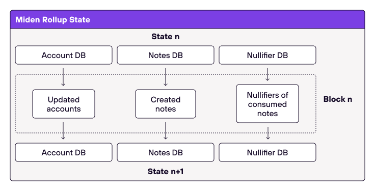
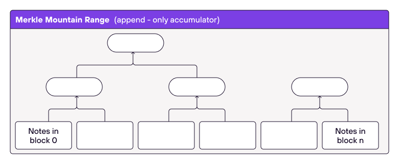

# State

The state of the network describes the current condition of all individual accounts and note states. The Miden Node(s) maintain three databases to describe the state:

1. A database of accounts,
2. A database of notes, and
3. A database of nullifiers for already consumed notes.

  

## State components

These databases are represented by authenticated data structures, which allows us to quickly show that objects were added to or withdrawn from a database, and a commitment to the database is minimal.

### Account DB
Current account states are recorded in a Tiered Sparse Merkle Tree which maps account IDs to account hashes, where the account hash is computed as:

`hash([account ID, 0, 0, nonce], [vault root], [storage root], [code root])`.

  

As described in [this document](https://0xpolygonmiden.github.io/miden-base/architecture/accounts.html), there are two types of accounts:
* **Public accounts** where all account data is stored on-chain.
* **Private accounts** where only the hashes of accounts are stored on-chain.

> Losing a state of a private account would mean loss of funds (as the user won't be able to execute transactions) in a similar manner as a loss of a private key would. This problem can be easily mitigated by storing encrypted account state in a cloud or backing it up somewhere else. Unlike storing private keys in the cloud, this does not compromise privacy or security of an account.

Note: Having many (or even most) of the accounts be private is very beneficial for the network as a private account contributes only 40 bytes to the global state (8 bytes account ID + 32 bytes account hash). Simply put, 1 billion private accounts takes up only $40$ GB of state.

### Note DB

Notes are recorded in an append-only accumulator, a [Merkle Mountain Range](https://github.com/opentimestamps/opentimestamps-server/blob/master/doc/merkle-mountain-range.md). This is important for two reasons:

1. Membership witnesses against such an accumulator needs to be updated very infrequently.
2. Old membership witnesses can be extended to be used with a new accumulator value, but this extension does not need to be done by the original witness holder.

Both of these properties are needed for supporting local transactions and privacy.

There are two types of [notes](https://0xpolygonmiden.github.io/miden-base/architecture/notes.html):
* **Public notes** where the entire note content is recorded in the state. 
* **Private notes** where only a note's hash is recorded in the state. 

As with accounts, there is a strong incentive to use private notes as they result in lower fees. This is also beneficial to the network as a private note adds only 64 bytes to the state (32 bytes when it is produced, and 32 bytes when it is consumed).

As shown in the below diagram, each leaf is a block header which contains the commitment to all notes created in that block. Note that the size of the Merkle Mountain Range grows logarithmically with the number of items in it.

  

Using a Merkle Mountain Range (append-only accumulator) means that we can't remove individual elements from it. This seemingly means that the size of the note database would grow indefinitely. Moreover, at high TPS, it would grow very quickly: at 1K TPS we'd be adding about 1TB/year to the database.

However, we need to explicitly store only the unconsumed public notes and enough info to construct membership proofs against them. Private notes, as well as public notes which have already been consumed, can be safely discarded. Such notes would still remain in the accumulator, but there is no need to store them explicitly as the append-only accumulator can be updated without knowing all items stored in it. This reduces actual storage requirements to a fraction of the database's nominal size.

ToDo: Describe and specify life-time restrictions for notes on the database. 

### Nullifier DB

Nullifier DB provides information on whether a specific note has been consumed yet. Nullifiers are stored in a [Tiered Sparse Merkle Tree](https://0xpolygonmiden.github.io/miden-base/crypto-primitives/tsmt.html), which maps nullifiers to `0` or `1`. Using this, one can check and prove that a given nullifier is not in the database. 

  

To prove that nullifier `11` is not in the database, the Operator needs to provide a Merkle path to its node, and then show that the value in that node is $0$. In our case nullifiers, are 32 bytes each and the height of the Sparse Merkle tree need to be 256.

To be able to add new nullifiers to the database, Operators needs to maintain the entire nullifier set. Otherwise, they would not be able to compute the new root of the tree. 

There will be one tree per epoch (~3 months), and Miden nodes always store trees for at least two epochs. However, the roots of the old trees are still stored. If a user wants to consume a note that is more than 6 month old, there must be a merkle path provided to the Miden Node for verification.
