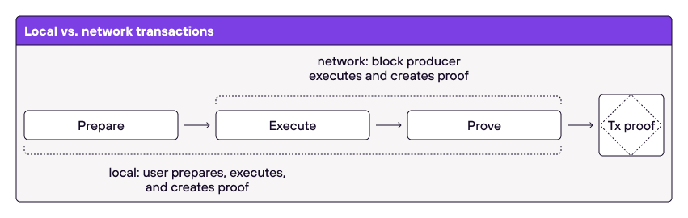

# Transactions
Transactions in Miden can be understood as facilitating account state changes. Asset transfers between accounts are done by executing transactions. Basically, they take one single account and some notes as input and output the same account at a new state together with some other notes. Miden aims for parallel and private transaction execution. Because a transaction is always performed against a single account Miden obtains asynchronicity. And, because every transaction causes a provable state-change and a STARK proof thereof it provides privacy, when executed locally.

## Transaction design
Transactions describe the state-transition of a single account that takes chain data and `0 to 1023` notes as input and produces a `TransactionWitness` and `0 to 4096` notes as output.

\
\

    

\
\

At its core, a transaction is an executable program processing the provided inputs and creating the requested outputs. Because the program is being executed in the Miden VM a STARK-proof is being generated for every transaction. 

### Transaction inputs
As inputs, a transaction requires 

- the **Account** including the [AccountID](https://0xpolygonmiden.github.io/miden-base/architecture/accounts.html#account-id) and the [AccountCode](https://0xpolygonmiden.github.io/miden-base/architecture/accounts.html#code) which will be executed during the transaction execution. 
- the **BlockHeader**, which contains metadata about the block, commitments to the current state of the chain and the hash of the proof that attests to the integrity of the chain.
- the **ChainMmr**, which allows for efficient authentication of consumed notes during transaction execution. Authentication is achieved by providing an inclusion proof for the consumed notes in the transaction against the ChainMmr root associated with the latest block known at the time of transaction execution.  
- the **Notes** that are being consumed in the transaction, including the corresponding note data, e.g. the [note script](https://0xpolygonmiden.github.io/miden-base/architecture/notes.html#script) and [serial number](https://0xpolygonmiden.github.io/miden-base/architecture/notes.html#serial-number).

### Transaction program
In addition to specifying inputs and outputs, a transaction must be represented by an executable program. The transaction program has a well-defined structure which must do the following:

1. **Prologue**: during this step we build a single unified vault all transaction inputs (account + notes).
2. **Execution**: during this step we first execute scripts of all input notes (one after another), and then execute an optional user-defined script (called tx script).
3. **Epilogue**: during this step we build a single unified vault of all transaction outputs (account + notes), and make sure it contains the same assets as the input vault.

The last point ensures that a transaction does not create or destroy any assets. A transaction can also include a user-defined transaction script. A transaction script is different to the [note scripts](https://0xpolygonmiden.github.io/miden-base/architecture/notes.html#script) that are executed during a transaction.

    

### Transaction outputs
A successfully executed transaction results the a new state of the provided account, a vector of all created Notes and a vector of all the consumed Notes and their Nullifiers and a STARK-proof. 

The transaction outputs are sufficient for the Miden Operator to verify a transaction and updating the [State](state.md) databases.

## Asset transfer using two transactions
Under this model transferring assets between accounts requires two transactions as shown in the diagram below.

    

The first transaction invokes a function on `account_a` (e.g., "send" function) which creates a new note and also updates the internal state of `account_a`. The second transaction consumes the note which invokes a function on `account_b` (e.g., "receive" function), which also updates the internal state of `account_b`.

It is important to note that both transactions can be executed asynchronously: first `transaction1` is executed, and then, some time later, `transaction2` can be executed. This opens up a few interesting possibilities:

* Owner of `account_b` may wait until there are many notes sent to them and process all incoming notes in a single transaction.
* A note script may include a clause which allows the source account to consume the note after some time. Thus, if `account_b` does not consume the note after the specified time, the funds can be returned. This mechanism could be used to **make sure funds sent to non-existent accounts are not lost**.
* Neither sender nor the recipient need to know who the other side is. From the sender's perspective they just need to create `note1` (and for this they need to know the assets to be transferred and the root of the note's script). They don't need any information on who will eventually consume the note. From the recipient's perspective, they just need to consume `note1`. They don't need to know who created it.
* Both transactions can be executed "locally". For example, we could generate a ZKP proving that `transaction1` was executed and submit it to the network. The network can verify the proof without the need for executing the transaction itself. Same can be done for `transaction2`. Moreover, we can mix and match. For example, `transaction1` can be executed locally, but `transaction2` can be executed on the network, or vice-versa.

## Local vs. network transactions
There are two types of transactions in Miden: local transactions and network transactions.

    

For **local transactions**, clients executing the transactions also generate the proofs of their correct execution. So, no additional work needs to be performed by the network. Local transactions are useful for several reasons:

1. They are cheaper (i.e., lower fees) as ZKPs are already generated by the clients.
2. They allow fairly complex computations because the proof size doesn't grow linearly with the complexity of the computation.
3. They enable privacy as neither the account state nor account code are needed to verify the ZKP.

For **network transactions**, the operator will execute the transaction and generate the proofs. Network transactions are useful for two reasons:

1. Clients may not have sufficient resources to generate ZK proofs.
2. Executing many transactions against the same public account by different clients would be challenging as the account state would change after every transaction. In this case, the Miden Node / Operator acts as a "synchronizer" as they can execute transactions sequentially and feed the output of the previous transaction into the subsequent one.
