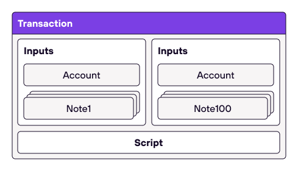
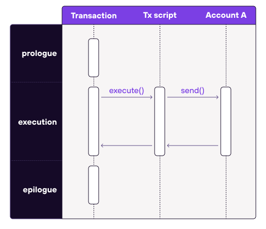

# Transactions
Asset transfers between accounts are done by executing transactions. A transaction is always executed against a single account and causes a provable state-change. It can consume zero or more notes, and it may produce zero or more notes as shown in the diagram below.

It can be expressed as a state-transition function that takes an account and `0 to n` notes to map it to another version of that account and produces `0 to n` notes   

$
T(A, \sum_{\substack{
   0<i<n
  }} 
 N(i))) \to (A', \sum_{\substack{
   0<j<m
  }} 
 N(j)) 
$
, where  $ A \in { Accounts }$, $N \in { Notes } $

It looks like 

    

In addition to specifying inputs and outputs, a transaction must also include an executable program. The transaction program has a well-defined structure which must do the following:

1. Build a single unified vault for all inputs.
2. Execute scripts of all input notes (the scripts are executed one after another).
3. Execute an optional user-defined script.
4. Build a single unified vault for all outputs.
5. Make sure the unified input and output vaults contain the same set of assets.

The last point ensures that a transaction does not create or destroy any assets.

A transaction can also include a user-defined transaction script. <Some more info here is missing>

## Execution steps of a transaction
Transaction execution consists of several steps. These steps (grouped slightly differently) are described below:

1. **Prologue**: during this step we build a single unified vault all all transaction inputs (account + notes).
2. **Execution**: during this step we first execute scripts of all input notes (one after another), and then execute an optional user-defined script (called tx script).
3. **Epilogue**: during this step we build a single unified vault of all transaction outputs (account + notes), and make sure it contains the same assets as the input vault.

### Example 1: transaction that sends assets out of a wallet (creating a note):

    

This transaction does not consume any notes but has tx script which calls the send function. Send function then creates an output note (not pictured).

### Example 2: transaction that receives assets (consuming a note)

    

As opposed to the previous transaction, this transaction consumes a single note (`note1`) but does not have a tx script.

## Example 3: asset transfer using two transactions
Under this model transferring assets between accounts requires two transactions as shown in the diagram below.

    

The first transaction invokes a function on `account_a` (e.g., "send" function) which creates a new note and also updates the internal state of `account_a`. The second transaction consumes the note which invokes a function on `account_b` (e.g., "receive" function), which also updates the internal state of `account_b`.

It is important to note that both transactions can be executed asynchronously: first `transaction1` is executed, and then, some time later, `transaction2` can be executed. This opens up a few interesting possibilities:

* Owner of `account_b` two may wait until there are many notes sent to them and process all incoming notes in a single transaction.
* A note script may include a clause which allows the source account to consume the note after some time. Thus, if `account_b` does not consume the note after the specified time, the funds can be returned. This mechanism could be used to make sure funds sent to non-existent accounts are not lost.
* Neither sender nor the recipient need to know who the other side is. From the sender's perspective they just need to create `note1` (and for this they need to know the assets to be transferred and the root of the note's script) - they don't need any information on who will eventually consume the note. From the recipients perspective, they just need to consume `note1`. They don't need to know who created it.
* Both transactions can be executed "locally" - e.g., we could generate a ZKP proving that transaction1 was executed and submit it to the network. The network can verify the proof without the need for executing the transaction itself. Same can be done for transaction2. Moreover, we can mix and match - e.g., transaction1 can be executed locally, but `transaction2` can be executed by the network, or vice-versa.

## Local vs. Network Transactions

    

There are two types of transactions: local transactions and network transactions.

For **local transactions**, clients executing the transactions also generate the proofs of their correct execution. So, no additional work needs to be performed by the network. Local transactions are useful for several reasons:

1. They are cheaper (i.e., lower fees) as ZKPs are already generated by the clients.
2. They allow fairly complex computations because the proof size doesn't grow linearly with the complexity of the computation.
3. They enable privacy as neither the account state nor account code are needed to verify the ZKP.

For **network transactions**, the operator will execute the transaction and generate the proofs. Network transactions are useful for two reasons:

1. Clients may not have sufficient resources to generate ZK proofs.
2. Executing many transactions against the same public account by different clients would be challenging as the account state would change after every transaction. In this case, the Miden Node / Operator acts as a "synchronizer" as they can execute transactions sequentially and feed the output of the previous transaction into the subsequent one.

