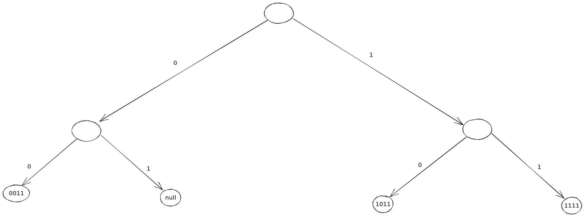
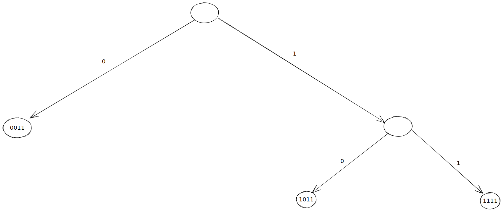

# Tiered Sparse Merkle Tree (TSMT)
A sparse Merkle tree (SMT) is a cryptographic data structure that allows authenticated manipulations of a key-value store i.e. a dictionary. It is a Merkle tree because it is
a binary tree in which each leaf node represents a key-value pair, and each non-leaf node represents the hash of the concatenation of its two child nodes. The index of the
leaf node in the tree corresponds to the key and the data stored in this node corresponds to the value. This implies that the depth of such a tree is logarithmic in the size of the key space, which implies that, for most key spaces used in practice, such a tree is impractical if done naively. However, the tree is sparse i.e it is going to be made up of mostly empty leaves which in turn implies that most sub-trees are empty with roots that can be pre-computed. 
A major issue with SMT is the fact that operations scale with the size of the key space meaning, for example, that if our key space has size $~ 2^{256}$ then performing any operation on the key-value store, for example an update, will require performing $256$ hashing operations.This is undesirable both inside as well as outside the STARK.


A common solution to this issue is to keep only non-empty leaves in the tree, which in practice means that sub-trees with only one non-empty child are replaced with the sub-tree rooted at that non-empty child. Here's an example of this:

```
          R
         / \
        /   \
       /     \
      R0      R1
     / \     / \
    A   B   o   o 
```

where `o` stands for an empty leaf. This tree gets compacted to

```
          R'
         / \
        /   \
       /     \
      A       B
```

A more extreme example of compaction is the following one:

```
                            R
                          /   \
                         /     \
                        /       \
                       /         \
                      /           \
                     /             \
                    /               \
                   /                 \
                  /                   \
                 /                     \
                /                       \
               /                         \
              /                           \
             /                             \
            /                               \
           /                                 \
          /                                   \
         /                                     \
        /                                       \
       /                                         \
      /                                           \
     /                                             \
    /                                               \
   /                                                 \
  -                                                   -
 / \                                                 / \
o   -                                               -   o
   / \                                             / \
  o   -                                           -   o
     / \                                         / \
    o   -                                       -   o
       / \                                     / \
      o   -                                   -   o
         / \                                 / \
        o   -                               -   o
           / \                             / \
          o   -                           -   o
             / \                         / \
            o   -                       -   o
               / \                     / \
              o   -                   -   o
                 / \                 / \
                o   -               -   o
                   / \             / \
                  o   -           -   o
                     / \         / \
                    o   -       -   o
                       / \     / \
                      o   -   o   -
                         / \     / \
                        A   B   C   D
```
where `o` signifies an empty sub-tree. This gets compacted to:

```
          R'
         / \
        /   \
       /     \
      -       -
     / \     / \
    A   B   C   D 
```

Compaction implies then that the tree depth is logarithmic in the size of the dictionary entries as opposed to the size of the key space. This in turn means that the number of hashing required for executing operations on the key-value map scales logarithmically in the size of the map.

The first documented implementation of a compact SMT was described [here](https://github.com/proofchains/python-proofmarshal/blob/master/proofmarshal/merbinnertree.py). This implementation relies on augmenting nodes with
a field called `prefix` which is the longest common prefix of all childs of a given node. A disadvantage of this implementation, as well as all known implementations of compact SMTs, is the reliance of their operations on bit-wise manipulations. This makes them very expensive to implement inside Miden VM.

Tiered sparse Merkle trees (TSMT) are a result of the idea that one can trade hashing for more efficient bit-wise operations. More precisely, in TSMT, compaction happens only at certain pre-specified tiers and this leads to simpler bit-wise manipulations. In the case of Miden Vm, compaction happens at depths `16`, `32`, `48` and `64`. To illustrate this, consider the following example where the keys have length 4 i.e. the SMT has depth 4.

<p align="center">
    
</p>

If we choose the tiers to be at depths 2 and 4 then the compact version of the above tree will look like

<p align="center">
    
</p>

If, however, we choose compaction at all possible depths we get a compact SMT that is similar to the [Jellyfish SMT](https://developers.diem.com/papers/jellyfish-merkle-tree/2021-01-14.pdf)

<p align="center">
    
</p>

We can see that a TSMT is a parametrized SMT, where the parameter is the number of tiers, that interpolates between a plain SMT with no compaction and a  (fully) compact SMT with compaction allowed at evey depth.

In Miden VM, the TSMT has a key space of size approximately `256` and in order to deal with keys sharing a common prefix of size greater than `64` we introduce a special type of leaf nodes at depth `64`. These leaf nodes are a sorted list of pairs `(key, value)` and sorting is done using `key`. Notice that all pairs in the sorted list have the same first part of the key, namely they share a common `64` bit prefix, and that all pairs with the same first part of the key belong in the same sorted list. The decision to go with a sorted list of pairs instead of a standard sub-tree node with multiple childs at depth `80` sharing the same `64` bit prefix is partially motivated by the fact that, for most scenarios related to Miden VM, the probability that two distinct keys will end up sharing a common prefix of length greater than or equal to `64` is very low, and even feasable grinding attacks can make the sorted list only slightly longer than a dozen of elements with very little clear benefits. Thus putting all pairs with the same first part of the key in a sorted list is a good tradeoff for dealing with prefixes of length greater than `64`.
