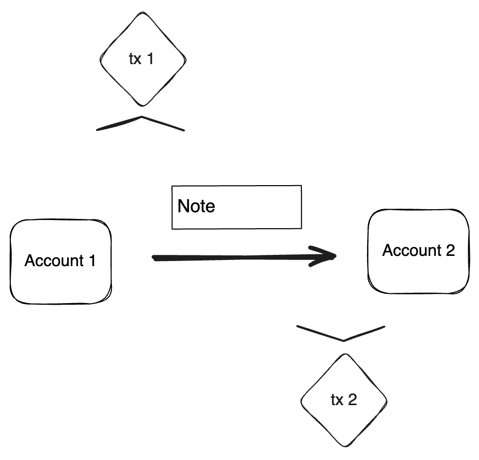
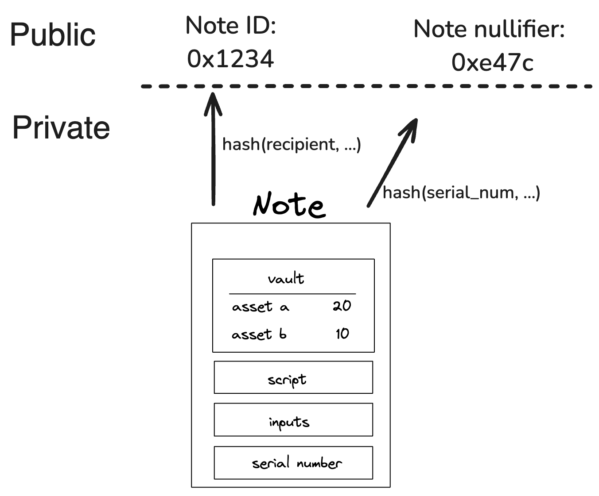

# Notes

A `Note` is the medium through which [Accounts](account.md) communicate. A `Note` holds assets and defines how they can be consumed.

## What is the purpose of a note?

In Miden's hybrid UTXO and account-based model notes represent UTXO's which enable parallel transaction execution and privacy through asynchronous local `Note` production and consumption. 

## Note core components

A `Note` is composed of several core components, illustrated below:

<p style="text-align: center;">
    
</p>

These components are:

1. [Assets](#assets)  
2. [Script](#script)  
3. [Inputs](#inputs)  
4. [Serial number](#serial-number)  
5. [Metadata](#metadata)

### Assets

> [!Note]
> An [asset](asset.md) container for a `Note`.

A `Note` can contain from 0 up to 256 different assets. These assets represent fungible or non-fungible tokens, enabling flexible asset transfers.

### Script

> [!Note]
> The code executed when the `Note` is consumed.

Each `Note` has a script that defines the conditions under which it can be consumed. When accounts consume notes in transactions, `Note` scripts call the account’s interface functions. This enables all sorts of operations beyond simple asset transfers. The Miden VM’s Turing completeness allows for arbitrary logic, making `Note` scripts highly versatile. There is no limit to the amount of code a `Note` can hold.

### Inputs

> [!Note]
> Arguments passed to the `Note` script during execution.

A `Note` can have up to 128 input values, which adds up to a maximum of 1 KB of data. The `Note` script can access these inputs. They can convey arbitrary parameters for `Note` consumption. 

### Serial number

> [!Note]
> A unique and immutable identifier for the `Note`.

The serial number has two main purposes. Firstly by adding some randomness to the `Note` it ensures it's uniqueness, secondly in private notes it helps prevent linkability between the note's hash and its nullifier. The serial number should be a random 32 bytes number chosen by the user. If leaked, the note’s nullifier can be easily computed, potentially compromising privacy.

### Metadata

> [!Note]
> Additional `Note` information.

Notes include metadata such as the sender’s account ID and a [tag](#note-discovery) that aids in discovery. Regardless of [storage mode](#note-storage-mode), these metadata fields remain public.

## Note Lifecycle

<p style="text-align: center;">
    
</p>

The `Note` lifecycle proceeds through four primary phases: **creation**, **validation**, **discovery**, and **consumption**. Creation and consumption requires two separate transactions. Throughout this process, notes function as secure, privacy-preserving vehicles for asset transfers and logic execution.

### Note creation

Accounts can create notes in a transaction. The `Note` exists if it is included in the global notes DB.

- **Users:** Executing local or network transactions.
- **Miden operators:** Facilitating on-chain actions, e.g. such as executing user notes against a DEX or other contracts.

#### Note storage mode

As with [accounts](account.md), notes can be stored either publicly or privately:

- **Public mode:** The `Note` data is stored in the [note database](state.md#note-database), making it fully visible on-chain.
- **Private mode:** Only the `Note`’s hash is stored publicly. The `Note`’s actual data remains off-chain, enhancing privacy.

### Note validation

Once created, a `Note` must be validated by a Miden operator. Validation involves checking the transaction proof that produced the `Note` to ensure it meets all protocol requirements.

After validation notes become "live" and eligible for consumption. If creation and consumption happens within the same block, there is no entry in the Notes DB. All other notes, are being added either as a commitment or fully public.

### Note discovery

Clients often need to find specific notes of interest. Miden allows clients to query the `Note` database using `Note` tags. These lightweight, 32-bit data fields serve as best-effort filters, enabling quick lookups for notes related to particular use cases, scripts, or account prefixes.

Using `Note` tags strikes a balance between privacy and efficiency. Without tags, querying a specific `Note` ID reveals a user’s interest to the operator. Conversely, downloading and filtering all registered notes locally is highly inefficient. Tags allow users to adjust their level of privacy by choosing how broadly or narrowly they define their search criteria, letting them find the right balance between revealing too much information and incurring excessive computational overhead.

### Note consumption

To consume a `Note`, the consumer must know its data, including the inputs needed to compute the nullifier. Consumption occurs as part of a transaction. Upon successful consumption a nullifier is generated for the consumed notes.

Upon successful verification of the transaction:

1. The Miden operator records the `Note`’s nullifier as "consumed" in the nullifier database.
2. The `Note`’s one-time claim is thus extinguished, preventing reuse.

#### Note recipient restricting consumption

Consumption of a `Note` can be restricted to certain accounts or entities. For instance, the P2ID and P2IDR `Note` scripts target a specific account ID. Alternatively, Miden defines a RECIPIENT (represented as 32 bytes) computed as:

```arduino
hash(hash(hash(serial_num, [0; 4]), script_root), input_commitment)
```

Only those who know the RECIPIENT’s pre-image can consume the `Note`. For private notes, this ensures an additional layer of control and privacy, as only parties with the correct data can claim the `Note`.

The [transaction prologue](transaction.md) requires all necessary data to compute the `Note` hash. This setup allows scenario-specific restrictions on who may consume a `Note`.

For a practical example, refer to the [SWAP note script](https://github.com/0xMiden/miden-base/blob/next/crates/miden-lib/asm/note_scripts/SWAP.masm), where the RECIPIENT ensures that only a defined target can consume the swapped asset.

#### Note nullifier ensuring private consumption

The `Note` nullifier, computed as:

```arduino
hash(serial_num, script_root, input_commitment, vault_hash)
```

This achieves the following properties:

- Every `Note` can be reduced to a single unique nullifier.
- One cannot derive a note's hash from its nullifier.
- To compute the nullifier, one must know all components of the `Note`: serial_num, script_root, input_commitment, and vault_hash.

That means if a `Note` is private and the operator stores only the note's hash, only those with the `Note` details know if this `Note` has been consumed already. Zcash first [introduced](https://zcash.github.io/orchard/design/nullifiers.html#nullifiers) this approach.


<p style="text-align: center;">
    
</p>