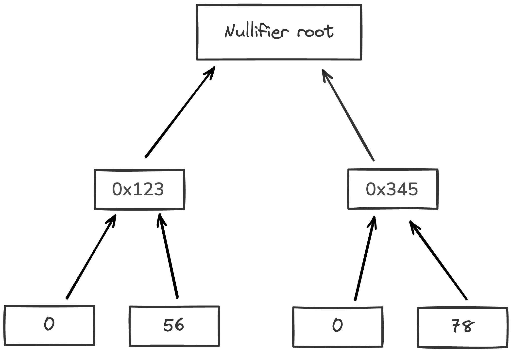
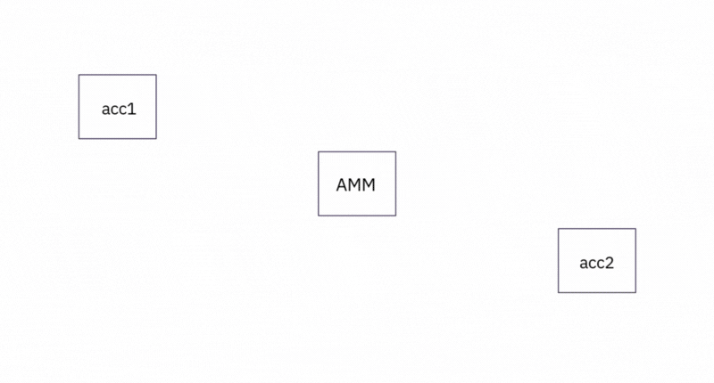

# State

The `State` describes the current condition of all accounts, notes, nullifiers and their statuses. Reflecting the "current reality" of the protocol at any given time.

## What is the purpose of the Miden state model?

By employing a concurrent `State` model with local execution and proving, Miden achieves three primary properties: preserving privacy, supporting parallel transactions, and reducing state-bloat by minimizing on-chain data storage.

Miden’s `State` model focuses on:

- **Concurrency:**
  Multiple transactions can be processed concurrently by distinct actors using local transaction execution which improves throughput and efficiency.

- **Flexible data storage:**
  Users can store data privately on their own devices or within the network. This approach reduces reliance on the network for data availability, helps maintain user sovereignty, and minimizes unnecessary on-chain storage.
 
- **Privacy:**
  By using notes and nullifiers, Miden ensures that value transfers remain confidential. Zero-knowledge proofs allow users to prove correctness without revealing sensitive information.

## State model components

The Miden node maintains three databases to describe `State`:

1. Accounts
2. Notes
3. Nullifiers

    

### Account database

The accounts database has two main purposes:

1. Track state commitments of all accounts
2. Store account data for public accounts

This is done using an authenticated data structure, a sparse Merkle tree.

    

As described in the [accounts section](account.md), there are two types of accounts:

- **Public accounts:** where all account data is stored on-chain.
- **Private accounts:** where only the commitments to the account is stored on-chain.

Private accounts significantly reduce storage overhead. A private account contributes only 40 bytes to the global `State` (15 bytes for the account ID + 32 bytes for the account commitment + 4 bytes for the block number). For example, 1 billion private accounts take up only 47.47 GB of `State`.

The storage contribution of a public account depends on the amount of data it stores.

> [!Warning]
> In Miden, when the user is the custodian of their account `State` (in the case of a private account), losing this `State` amounts to losing their funds, similar to losing a private key.

### Note database

As described in the [notes section](note.md), there are two types of notes:

- **Public notes:** where the entire note content is stored on-chain.
- **Private notes:** where only the note’s commitment is stored on-chain.

Private notes greatly reduce storage requirements and thus result in lower fees. At high throughput (e.g., 1K TPS), the note database could grow by about 1TB/year. However, only unconsumed public notes and enough information to construct membership proofs must be stored explicitly. Private notes, as well as consumed public notes, can be discarded. This solves the issue of infinitely growing note databases.

Notes are recorded in an append-only accumulator, a [Merkle Mountain Range](https://github.com/opentimestamps/opentimestamps-server/blob/master/doc/merkle-mountain-range.md). 

Using a Merkle Mountain Range (append-only accumulator) is important for two reasons:

1. Membership witnesses (that a note exists in the database) against such an accumulator needs to be updated very infrequently.
2. Old membership witnesses can be extended to a new accumulator value, but this extension does not need to be done by the original witness holder.
 
Both of these properties are needed for supporting local transactions using client-side proofs and privacy. In an append-only data structure, witness data does not become stale when the data structure is updated. That means users can generate valid proofs even if they don’t have the latest `State` of this database; so there is no need to query the operator on a constantly changing `State`.

    

### Nullifier database

Each [note](note.md) has an associated nullifier which enables the tracking of whether its associated note has been consumed or not, preventing double-spending.

To prove that a note has not been consumed, the operator must provide a Merkle path to the corresponding node and show that the node’s value is 0. Since nullifiers are 32 bytes each, the sparse Merkle tree height must be sufficient to represent all possible nullifiers. Operators must maintain the entire nullifier set to compute the new tree root after inserting new nullifiers. For each nullifier we also record the block in which it was created. This way "unconsumed" nullifiers have block 0, but all consumed nullifiers have a non-zero block.

> [!Note]
> Nullifiers in Miden break linkability between privately stored notes and their consumption details. To know the [note’s nullifier](note.md#note-nullifier-ensuring-private-consumption), one must know the note’s data.

    

## Additional information

### Public shared state

In most blockchains, most smart contracts and decentralized applications (e.g., AAVE, Uniswap) need public shared `State`. Public shared `State` is also available on Miden and can be represented as in the following example:

    

In this diagram, multiple participants interact with a common, publicly accessible `State` (the AMM in the center). The figure illustrates how notes are created and consumed:

1. **Independent Transactions Creating Notes (tx1 & tx2):**
   Two separate users (Acc1 and Acc2) execute transactions independently:
   - **tx1** creates **note1**
   - **tx2** creates **note2**

   These transactions occur in parallel and do not rely on each other, allowing concurrent processing without contention.

2. **Sequencing and Consuming Notes (tx3):**  
   The Miden node executes tx3 against the shared account, consuming **note1 & note2** and creating **note3 & note4**. tx3 is a network transaction executed by the Miden operator. It merges independent contributions into a unified `State` update.

3. **Further Independent Transactions (tx4 & tx5):**  
   After the shared `State` is updated:
   - **tx4** consumes **note4**
   - **tx5** consumes **note3**
   
   Both users can now interact independently and in parallel with notes generated by the public account, continuing the cycle of `State` evolution.

### State bloat minimization

Miden nodes do not need to know the entire `State` to verify or produce new blocks. Rather than storing the full `State` data with the nodes, users keep their data locally, and the rollup stores only commitments to that data. While some contracts must remain publicly visible, this approach minimizes `State` bloat. Furthermore the Miden rollup can discard non-required data after certain conditions have been met.

This ensures that the account and note databases remain manageable, even under sustained high usage.
