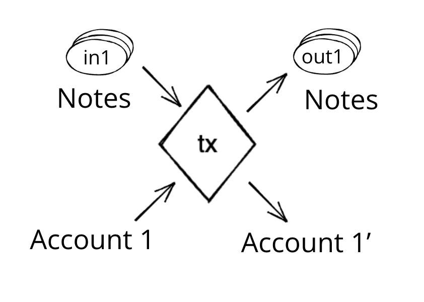
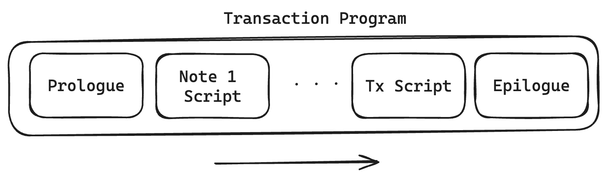

# Transactions

A `Transaction` in Miden is the state transition of a single account. A `Transaction` takes as input a single [account](account.md) and zero or more [notes](note.md), and outputs the same account with an updated state, together with zero or more notes. Transactions in Miden are Miden VM programs, their execution resulting in the generation of a zero-knowledge proof.

Miden's `Transaction` model aims for the following:

- **Parallel transaction execution**: Accounts can update their state independently from each other and in parallel.
- **Private transaction execution**: Client-side `Transaction` proving allows the network to verify transactions validity with zero-knowledge.

    

Compared to most blockchains, where a `Transaction` typically involves more than one account (e.g., sender and receiver), a `Transaction` in Miden involves a single account. To illustrate, Alice sends 5 ETH to Bob. In Miden, sending 5 ETH from Alice to Bob takes two transactions, one in which Alice creates a note containing 5 ETH and one in which Bob consumes that note and receives the 5 ETH. This model removes the need for a global lock on the blockchain's state, enabling Miden to process transactions in parallel.

Currently the protocol limits the number of notes that can be consumed and produced in a transaction to 1000 each, which means that in a single `Transaction` an application could serve up to 2000 different user requests like deposits or withdrawals into/from a pool.

A simple transaction currently takes about 1-2 seconds on a MacBook Pro. It takes around `90K` cycles to create the proof, as of now the signature verification step is the dominant cost.

## Transaction lifecycle

Every `Transaction` describes the process of an account changing its state. This process is described as a Miden VM program, resulting in the generation of a zero-knowledge proof. Transactions are being executed in a specified sequence, in which several notes and a transaction script can interact with an account.

    

### Inputs

A `Transaction` requires several inputs:

- **Account**: A `Transaction` is always executed against a single account. The executor must have complete knowledge of the account's state.
- **Notes**: A `Transaction` can consume and output up to `1024` notes. The executor must have complete knowledge of the note data, including note inputs, before consumption. For private notes, the data cannot be fetched from the blockchain and must be received through an off-chain channel.
- **Blockchain state**: The current reference block and information about the notes database used to authenticate notes to be consumed must be retrieved from the Miden operator before execution. Usually, notes to be consumed in a `Transaction` must have been created before the reference block.
- **Transaction script (optional)**: The `Transaction` script is code defined by the executor. And like note scripts, they can invoke account methods, e.g., sign a transaction. There is no limit to the amount of code a `Transaction` script can hold.
- **Transaction arguments (optional)**: For every note, the executor can inject transaction arguments that are present at runtime. If the note script — and therefore the note creator — allows, the note script can read those arguments to allow dynamic execution. See below for an example.
- **Foreign account data (optional)**: Any foreign account data accessed during a `Transaction`, whether private or public, must be available beforehand. There is no need to know the full account storage, but the data necessary for the `Transaction`, e.g., the key/value pair that is read and the corresponding storage root.

### Flow

1. **Prologue**
   Executes at the beginning of a transaction. It validates on-chain commitments against the provided data. This is to ensure that the transaction executes against a valid on-chain recorded state of the account and to be consumed notes. Notes to be consumed must be registered on-chain — except for [erasable notes](note.md) which can be consumed without block inclusion.
2. **Note processing**
   Notes are executed sequentially against the account, following a sequence defined by the executor. To execute a note means processing the note script that calls methods exposed on the account interface. Notes must be consumed fully, which means that all assets must be transferred into the account or into other created notes. [Note scripts](note.md#script) can invoke the account interface during execution. They can push assets into the account's vault, create new notes, set a transaction expiration, and read from or write to the account’s storage. Any method they call must be explicitly exposed by the account interface. Note scripts can also invoke methods of foreign accounts to read their state.
3. **Transaction script processing**
   `Transaction` scripts are an optional piece of code defined by the executor which interacts with account methods after all notes have been executed. For example, `Transaction` scripts can be used to sign the `Transaction` (e.g., sign the transaction by incrementing the nonce of the account, without which, the transaction would fail), to mint tokens from a faucet, create notes, or modify account storage. `Transaction` scripts can also invoke methods of foreign accounts to read their state.
4. **Epilogue**
   Completes the execution, resulting in an updated account state and a generated zero-knowledge proof. The validity of the resulting state change is checked. The account's `Nonce` must have been incremented, which is how the entire transaction is authenticated. Also, the net sum of all involved assets must be `0` (if the account is not a faucet).

The proof together with the corresponding data needed for verification and updates of the global state can then be submitted and processed by the network.

## Examples

To illustrate the `Transaction` protocol, we provide two examples for a basic `Transaction`. We will use references to the existing Miden `Transaction` kernel — the reference implementation of the protocol — and to the methods in Miden Assembly.

### Creating a P2ID note

Let's assume account A wants to create a P2ID note. P2ID notes are pay-to-ID notes that can only be consumed by a specified target account ID. Note creators can provide the target account ID using the [note inputs](note.md#inputs).

In this example, account A uses the basic wallet and the authentication component provided by `miden-lib`. The basic wallet component defines the methods `wallets::basic::create_note` and `wallets::basic::move_asset_to_note` to create notes with assets, and `wallets::basic::receive_asset` to receive assets. The authentication component exposes `auth::basic::auth_tx_rpo_falcon512` which allows for signing a transaction. Some account methods like `account::get_id` are always exposed.

The executor inputs to the Miden VM a `Transaction` script in which he places on the stack the data (tag, aux, note_type, execution_hint, RECIPIENT) of the note(s) that he wants to create using `wallets::basic::create_note` during the said `Transaction`. The [`NoteRecipient`](https://github.com/0xMiden/miden-base/blob/main/crates/miden-objects/src/note/recipient.rs) is a value that describes under which condition a note can be consumed and is built using a `serial_number`, the `note_script` (in this case P2ID script) and the `note_inputs`. The Miden VM will execute the `Transaction` script and create the note(s). After having been created, the executor can use `wallets::basic::move_asset_to_note` to move assets from the account's vault to the notes vault.

After finalizing the `Transaction` the updated state and created note(s) can now be submitted to the Miden operator to be recorded on-chain.

### Consuming a P2ID note

Let's now assume that account A wants to consume a P2ID note to receive the assets contained in that note.

To start the transaction process, the executor fetches and prepares all the input data to the `Transaction`. First, it retrieves blockchain data, like global inputs and block data of the most recent block. This information is needed to authenticate the native account's state and that the P2ID note exists on-chain. Then it loads the full account and note data, to start the `Transaction` execution.

In the transaction's prologue the data is being authenticated by re-hashing the provided values and comparing them to the blockchain's data (this is how private data can be used and verified during the execution of transaction without actually revealing it to the network).

Then the P2ID note script is being executed. The script starts by reading the note inputs `note::get_inputs` — in our case the account ID of the intended target account. It checks if the provided target account ID equals the account ID of the executing account. This is the first time the note invokes a method exposed by the `Transaction` kernel, `account::get_id`.

If the check passes, the note script pushes the assets it holds into the account's vault. For every asset the note contains, the script calls the `wallets::basic::receive_asset` method exposed by the account's wallet component. The `wallets::basic::receive_asset` procedure calls `account::add_asset`, which cannot be called from the note itself. This allows accounts to control what functionality to expose, e.g. whether the account supports receiving assets or not, and the note cannot bypass that.

After the assets are stored in the account's vault, the transaction script is being executed. The script calls `auth::basic::auth_tx_rpo_falcon512` which is explicitly exposed in the account interface. The method is used to verify a provided signature against a public key stored in the account's storage and a commitment to this specific transaction. If the signature can be verified, the method increments the nonce.

The Epilogue finalizes the transaction by computing the final account hash, asserting the nonce increment and checking that no assets were created or destroyed in the transaction — that means the net sum of all assets must stay the same.

## Transaction types

There are two types of transactions in Miden: **local transactions** and **network transactions** [not yet implemented].

### Local transaction

Users transition their account's state locally using the Miden VM and generate a `Transaction` proof that can be verified by the network, which we call **client-side proving**. The network then only has to verify the proof and to change the global parts of the state to apply the state transition.

They are useful, because:

1. They enable privacy as neither the account state nor account code are needed to verify the zero-knowledge proof. Public inputs are only commitments and block information that are stored on-chain.
2. They are cheaper (i.e., lower in fees) as the execution of the state transition and the generation of the zero-knowledge proof are already made by the users. Hence **privacy is the cheaper option on Miden**.
3. They allow arbitrarily complex computation to be done. The proof size doesn't grow linearly with the complexity of the computation. Hence there is no gas limit for client-side proving.

Client-side proving or local transactions on low-power devices can be slow, but Miden offers a pragmatic alternative: **delegated proving**. Instead of waiting for complex computations to finish on your device, you can hand off proof generation to a service, ensuring a consistent 1-2 second proving time, even on mobile.

### Network transaction

The Miden operator executes the `Transaction` and generates the proof. Miden uses network transactions for smart contracts with public shared state. This type of `Transaction` is quite similar to the ones in traditional blockchains (e.g., Ethereum).

They are useful, because:

1. For public shared state of smart contracts. Network transactions allow orchestrated state changes of public smart contracts without race conditions.
2. Smart contracts should be able to be executed autonomously, ensuring liveness. Local transactions require a user to execute and prove, but in some cases a smart contract should be able to execute when certain conditions are met.
3. Clients may not have sufficient resources to generate zero-knowledge proofs.

The ability to facilitate both, local and network transactions, **is one of the differentiating factors of Miden** compared to other blockchains. Local `Transaction` execution and proving can happen in parallel as for most transactions there is no need for public state changes. This increases the network's throughput tremendously and provides privacy. Network transactions on the other hand enable autonomous smart contracts and public shared state.

---

> [!Tip]
>
> - Usually, notes that are consumed in a `Transaction` must be recorded on-chain in order for the `Transaction` to succeed. However, Miden supports **erasable notes** which are notes that can be consumed in a `Transaction` before being registered on-chain. For example, one can build a sub-second order book by allowing its traders to build faster transactions that depend on each other and are being validated or erased in batches.
>
> - There is no nullifier check during a `Transaction`. Nullifiers are checked by the Miden operator during `Transaction` verification. So at the local level, there is "double spending." If a note was already spent, i.e. there exists a nullifier for that note, the block producer would never include the `Transaction` as it would make the block invalid.
>
> - One of the main reasons for separating execution and proving steps is to allow _stateless provers_; i.e., the executed `Transaction` has all the data it needs to re-execute and prove a `Transaction` without database access. This supports easier proof-generation distribution.
>
> - Not all transactions require notes. For example, the owner of a faucet can mint new tokens using only a `Transaction` script, without interacting with external notes.
>
> - In Miden executors can choose arbitrary reference blocks to execute against their state. Hence it is possible to set `Transaction` expiration heights and in doing so, to define a block height until a `Transaction` should be included into a block. If the `Transaction` is expired, the resulting account state change is not valid and the `Transaction` cannot be verified anymore.
>
> - Note and `Transaction` scripts can read the state of foreign accounts during execution. This is called foreign procedure invocation. For example, the price of an asset for the **Swap** script might depend on a certain value stored in the oracle account.
>
> - An example of the right usage of `Transaction` arguments is the consumption of a **Swap** note. Those notes allow asset exchange based on predefined conditions. Example:
>   - The note's consumption condition is defined as "anyone can consume this note to take `X` units of asset A if they simultaneously create a note sending Y units of asset B back to the creator." If an executor wants to buy only a fraction `(X-m)` of asset A, they provide this amount via transaction arguments. The executor would provide the value `m`. The note script then enforces the correct transfer:
>     - A new note is created returning `Y-((m*Y)/X)` of asset B to the sender.
>     - A second note is created, holding the remaining `(X-m)` of asset A for future consumption.
>
> - When executing a `Transaction` the max number of VM cycles is **$2^{30}$**.
